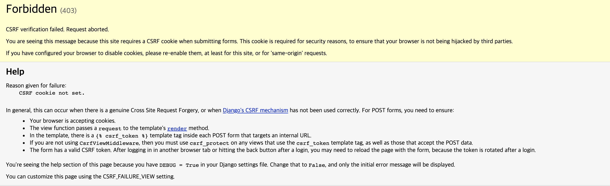
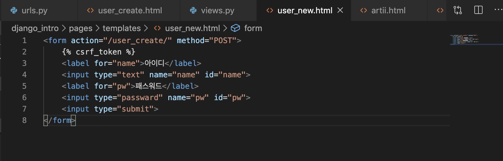
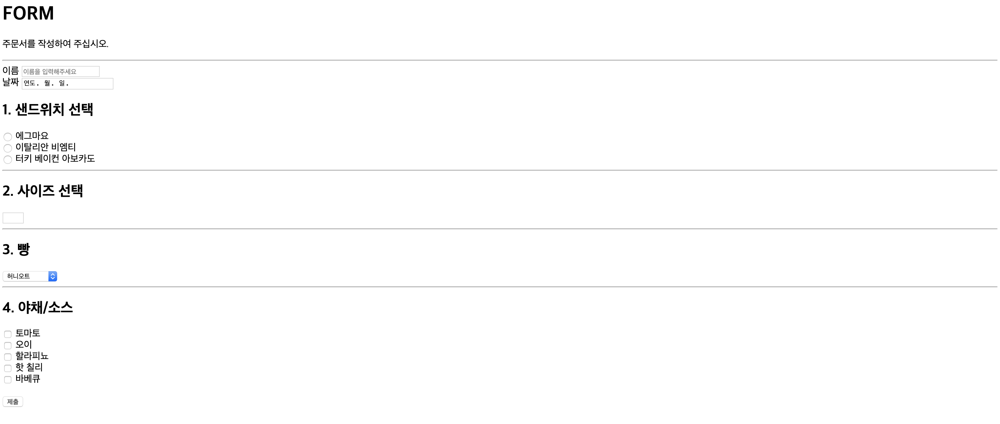
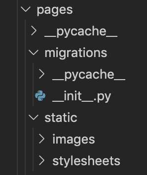

# 파이썬 5일차

## 1. Form

- form : action - 데이터가 전송될 URL, method - GET/POST
- input : name(데이터 넘길 때, view에서 이 설정값을 가져올 수 있음)
  - name : key / value : value
- label : for  옵션 input의 id값과 매치(이름표)


## 2. GET

- data가 body를 통한게 아니라 쿼리스트링으로 넘어감

- 데이터를 조회할 때 사용

  ## *실습

  - 설정순

  `urls.py`

  ```python
  from django.contrib import admin
  from django.urls import path
  from pages import views
  
  urlpatterns = [
      path('admin/', admin.site.urls),
      path('throw/', views.throw),
      path('catch/', views.catch),
      path('lotto/', views.lotto),
      path('lotto_result/', views.lotto_result),
  ]
  ```

  `views.py`

  ```python
  from django.shortcuts import render
  import random
  
  # Create your views here.
  def throw(request):
      return render(request, 'throw.html')
  
  def catch(request):
      # print(request)
      # print(request.path)
      # print(request.method)
     
      # print(request.META)
      message = request.GET.get('message')
      message2 = request.GET.get('message2')
  
      context={
          'msg':message,
          'msg2':message2
      }
  
      return render(request, 'catch.html', context)
  
  def lotto(request):
      return render(request, 'lotto.html')
  
  def lotto_result(request):
      count = int(request.GET.get('count'))
      print(type(count))
      lotto_num=[]
      for i in range(count):
          lotto_num.append(random.sample(range(1,47), 6))
  
          context = {
              'count':count,
              'lotto_num':lotto_num
          }
      return render(request, 'lotto_result.html', context)
  
  ```

  

  `throw.html`

  ```html
  <form action="/catch/" method="GET">
      <label for="msg"></label>
      <input type="text" name="message" id="msg">
      <label for="msg2"></label>
      <input type="text" name="message2" id="msg2">
      <input type="submit">
  </form>
  ```

  `catch.html`

   ```html
  <h1> 받을 내용 : {{ msg }} // {{ msg2 }}</h1>
   ```

  

  `lotto.html`

  ```html
  <form action="/lotto_result/" method="GET">
      <label for="count">몇개 살거?</label>
      <input type="text" name="count" id="count">
      <input type="submit">
  </form>
  ```

  

  `lotto_result.html`

  ```html
  <h1>{{ count }}개 구매함.</h1>
  
  <ol>
  
      <li>{{ lotto }}</li>
  
  </ol>
  ```

  

## 3. 과제

```
ASKII ART API를 이용한 실습

1. 입력한 Text를 Artii api를 이용하여 화면에 출력
 - 텍스트 받기 위해 form필요
 - form date를 받아서 artii에 요청
 		- requests 모듈 이용
 		- import requests
 		- request.get('요청할 곳 URL')
 		- 요청할 URL 분석
 		- requests로 받은 값을 그대로 html에 뿌려준다.
 		
2. font를 랜덤하게 설정해서 출력
```

- `artii`, `artii_result`

```python
def artii_result(request):
    message = request.GET.get('msg')
    f_url='http://artii.herokuapp.com/fonts_list'
    fonts=requests.get(f_url).text
    fonts = fonts.split('\n')
    
    font=random.choice(fonts)
    url=f'http://artii.herokuapp.com/make?text={message}&font={font}'

    url_result=requests.get(url)
    context={
        'url_result':url_result.text # text로 바꿔주는 것
    }

    return render(request, 'artii_result.html', context)
```

- `artii.html`

```html
<form action="/artii_result/" method="GET">
<label for="msg">메세지 입력</label>
<input type="text" name="msg" id="msg">
<input type="submit">
</form>
```

- `artti_result.html`

```html
<h1>아스키 코드</h1>
<pre>{{ url_result }}</pre>
<!-- pre(precommented text) 태그는 있는 그대로 가져올 때 사용하는 태그 -->
<!-- 그래서 context로 받아올 때 text로 바꿔줘야 한다. -->
```


## 4. POST

- 디비를 생성/변경 할 때 주로 사용하고 html body 정보를 담아 전송

- 원칙적으로 POST요청은 html 파일로 응답하면 안됨

  - post 요청이 오면 get 요청 받는 페이지로 redirect (RESTful)

- Django는 post data를 그냥 보내지 않음

  - `csrf_token`을 같이 보냄

  - Cross Site Request Forgery

  - 토큰을 보내지 않으면

    - 403 forbidden error			

      

- 해결 방법	

## 6. 실습2

```
subway form 만들기
```



- `Subway_form, subway_result.py`

```python
def subway_form(request):
    return render(request, 'subway_form.html')

def subway_result(request):
    username=request.POST.get('name')
    date=request.POST.get('date')
    sandwich=request.POST.get('sandwich')
    size=request.POST.get('size')
    bread=request.POST.get('bread')
    source=request.POST.getlist('source')

    context={
        'username':username,
        'date':date,
        "sandwich":sandwich,
        'size':size,
        'bread':bread,
        'source': ", ".join(source)
    }
    return render(request, 'subway_result.html',context)
```


- `Subway_form.html`

```html
<h1>FORM</h1>
<p>주문서를 작성하여 주십시오.</p>
<hr>
<form action="/subway_result/" method="POST">
    
    <label for="name">이름</label>
<input type="text" name="name" id="name" placeholder="이름을 입력해주세요"><br>
<label for="date">날짜</label>
<input type="date" name="date" id="date" placeholder="2019. 01. 03">
<h2>1. 샌드위치 선택</h2>
<input type="radio" name="sandwich" value="에그마요">
<label for="sandwich">에그마요</label><br>
<input type="radio" name="sandwich" value="이탈리안 비엠티">
<label for="sandwich">이탈리안 비엠티</label><br>
<input type="radio" name="sandwich" value="터키 베이컨 아보카도">
<label for="sandwich">터키 베이컨 아보카도</label><br>
<hr>
<h2>2. 사이즈 선택</h2>
<label for="size"></label>
<input type="number" name="size" min=15 max=30 step=15>
<hr>
<h2>3. 빵</h2>
<select type="dropdown" name="bread">
        <option value="허니오트">허니오트</option>
        <option value="플랫브레드">플랫브레드</option>
        <option value="리티 이탈리안">리티 이탈리안</option>
</select>
<hr>
<h2>4. 야채/소스</h2>
<input type="checkbox" name="source" value="토마토">
<label for="source">토마토</label><br>
<input type="checkbox" name="source" value="오이">
<label for="source">오이</label><br>
<input type="checkbox" name="source" value="할라피뇨">
<label for="source">할라피뇨</label><br>
<input type="checkbox" name="source" value="핫 칠리">
<label for="source">핫 칠리</label><br>
<input type="checkbox" name="source" value="바베큐">
<label for="source">바베큐</label><br>
<br>
<input type="submit">
</form>
```


- `subway_result.html`

```html
<h1>{{ username }}고객님 안녕하세요</h1>
<h2>{{ date }}에 주문하신 건입니다.</h2>
<p>선택한 샌드위치는 : {{ sandwich }}</p>
<p>선택한 빵은 : {{ bread }}</p>
<p>선택한 사이즈는 : {{ size }}</p>
<p>선택한 야채 및 소스는 : {{ source }}</p>
```


## 7. Static URL

- ``	을 html 최상단에 추가

- `` 파일 경로는 app폴더 아래 static 폴더로 관리가 됨(templates와 비슷)

- 세팅

  - stylesheets 폴더 생성

  



​	  

- `Style.css`

```css
h1 {
    color: blue;
}
```

- `static.html`

```html

<link rel="stylesheet" href="">
<body>
    <h1>Static 파일 실습</h1>
    
</body>
```

