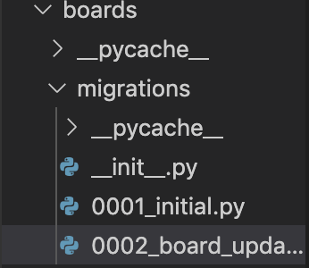
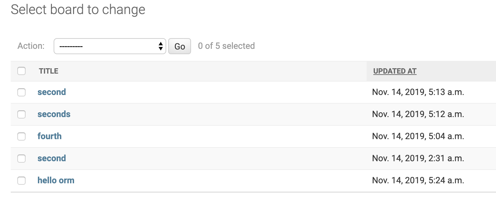
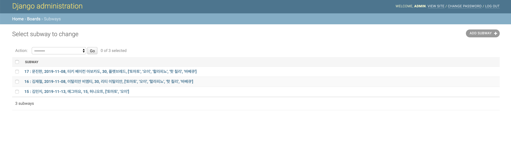

# 파이썬 6일차

## 1. ORM

### 	1. MTV

- 모델(모델) / 템플릿(뷰) / 뷰(컨트롤러)


### 	2. 데이터베이스 기본구조

- 쿼리 : 데이터를 질의 하는 조회 명령어
- Db : 체계화된 데이터의 모임
- 스키마 : 디비 자료의 구조, 표현방법, 관계 정의한 구조
- 테이블
  - 필드 : 컬럼
  - 레코드 : 데이터


### 	3. ORM 장점

- sql을 몰라도 사용이 가능
- 코드의 가독성이 상승

- 인스턴스로 호출하기 때문에 생산성이 높아짐
- ERD의 의존도를 낮춤

- 인스턴스 생성 -> 뷰로 날라가기 때문에 견고


	### 	4. ORM 단점

- 모든 것을 orm으로 하기엔 무리
- 규모가 커지면 난이도 상승


	### 5. 실습

```python
(env) ip-70-12-227-176:Day6 minji$ python manage.py shell
Python 3.7.5 (v3.7.5:5c02a39a0b, Oct 14 2019, 18:49:57) 
[Clang 6.0 (clang-600.0.57)] on darwin
Type "help", "copyright", "credits" or "license" for more information.
(InteractiveConsole)
>>> class Person:
...     name = "사람의 고유한 이름"
...     age="출생 이후로 부터 삶을 마감할 때까지의 기간"
...     def greeting(self):
...             print(f'{self.name}이 인사합니다.')
...     def eating(self):
...             print(f'{self.name}이 밥을 먹고 있습니다.')
...     def aging(self):
...             print(f'{self.name}은 현재 {self.age}살이지만 점점 나이를 더 먹겠죠.')
... 
>>> justin=Person()
>>> print(justin.name)
사람의 고유한 이름
>>> justin.age = 19
>>> print(justin.age)
19
>>> greeting(justin)
Traceback (most recent call last):
  File "<console>", line 1, in <module>
NameError: name 'greeting' is not defined
>>> print(Person.name)
사람의 고유한 이름
>>> print(Person.age)
출생 이후로 부터 삶을 마감할 때까지의 기간
>>> print(justin.age)
19
>>> print(justin.greeting)
<bound method Person.greeting of <Person object at 0x110c7f2d0>>
>>> print(justin.greeting())
사람의 고유한 이름이 인사합니다.
None
>>> justin.greeting()
사람의 고유한 이름이 인사합니다.
>>> justin.name = "수능 보는 justin"
>>> justin.greeting()
수능 보는 justin이 인사합니다.
>>> justin.eating()
수능 보는 justin이 밥을 먹고 있습니다.
>>> justin.aging()
수능 보는 justin은 현재 19살이지만 점점 나이를 더 먹겠죠.
```


### 6. Model

- 모델은 단일 데이터에 대한 정보를 가지고 있다.
  - 필수적인 필드(컬럼)과 데이터(레코드)에 대한 정보를 포함

- 각각의 모델은 단일 각각 DB 테이블과 매핑 
- 사용자가 저장하는 데이터들의 필수적인 필드(컬럼) 동작을 포함


### 7. Models.py 실습

```python
from django.db import models

# Create your models here.
class Board(models.Model):
    title = models.CharField(max_length=10) # 최대 글자수 =10
    content = models.TextField() # 텍스트 부분은 글자제한이 없도록
    created_at = models.DateTimeField(auto_now_add=True) # 오늘 날짜로 수정된 사항이 저장되게만들기
     updated_at = models.DateTimeField(auto_now=True)# 수정될 때 시간이 저장
```

```bash
ip-70-12-227-176:Day6 minji$ python manage.py makemigrations
```



```bash
# 수정 사항을 확인하고 싶을 때
ip-70-12-227-176:Day6 minji$ python manage.py sqlmigrate boards 0001
BEGIN;
--
-- Create model Board
--
CREATE TABLE "boards_board" ("id" integer NOT NULL PRIMARY KEY AUTOINCREMENT, "title" varchar(10) NOT NULL, "content" text NOT NULL, "created_at" datetime NOT NULL);
COMMIT;
```

```bash
ip-70-12-227-176:Day6 minji$ python manage.py showmigrations
admin
 [ ] 0001_initial
 [ ] 0002_logentry_remove_auto_add
 [ ] 0003_logentry_add_action_flag_choices
auth
 [ ] 0001_initial
 [ ] 0002_alter_permission_name_max_length
 [ ] 0003_alter_user_email_max_length
 [ ] 0004_alter_user_username_opts
 [ ] 0005_alter_user_last_login_null
 [ ] 0006_require_contenttypes_0002
 [ ] 0007_alter_validators_add_error_messages
 [ ] 0008_alter_user_username_max_length
 [ ] 0009_alter_user_last_name_max_length
 [ ] 0010_alter_group_name_max_length
 [ ] 0011_update_proxy_permissions
boards
 [ ] 0001_initial
 [ ] 0002_board_updated_at # 빈칸은 적용되기 전 상태
contenttypes
 [ ] 0001_initial
 [ ] 0002_remove_content_type_name
sessions
 [ ] 0001_initial
```

```bash
# 데이터베이스 적용시키기
ip-70-12-227-176:Day6 minji$ python manage.py migrate
Operations to perform:
  Apply all migrations: admin, auth, boards, contenttypes, sessions
Running migrations:
  Applying contenttypes.0001_initial... OK
  Applying auth.0001_initial... OK
  Applying admin.0001_initial... OK
  Applying admin.0002_logentry_remove_auto_add... OK
  Applying admin.0003_logentry_add_action_flag_choices... OK
  Applying contenttypes.0002_remove_content_type_name... OK
  Applying auth.0002_alter_permission_name_max_length... OK
  Applying auth.0003_alter_user_email_max_length... OK
  Applying auth.0004_alter_user_username_opts... OK
  Applying auth.0005_alter_user_last_login_null... OK
  Applying auth.0006_require_contenttypes_0002... OK
  Applying auth.0007_alter_validators_add_error_messages... OK
  Applying auth.0008_alter_user_username_max_length... OK
  Applying auth.0009_alter_user_last_name_max_length... OK
  Applying auth.0010_alter_group_name_max_length... OK
  Applying auth.0011_update_proxy_permissions... OK
  Applying boards.0001_initial... OK
  Applying boards.0002_board_updated_at... OK
  Applying sessions.0001_initial... OK
  
 ip-70-12-227-176:Day6 minji$ python manage.py showmigrations
admin
 [X] 0001_initial
 [X] 0002_logentry_remove_auto_add
 [X] 0003_logentry_add_action_flag_choices
auth
 [X] 0001_initial
 [X] 0002_alter_permission_name_max_length
 [X] 0003_alter_user_email_max_length
 [X] 0004_alter_user_username_opts
 [X] 0005_alter_user_last_login_null
 [X] 0006_require_contenttypes_0002
 [X] 0007_alter_validators_add_error_messages
 [X] 0008_alter_user_username_max_length
 [X] 0009_alter_user_last_name_max_length
 [X] 0010_alter_group_name_max_length
 [X] 0011_update_proxy_permissions
boards
 [X] 0001_initial
 [X] 0002_board_updated_at
contenttypes
 [X] 0001_initial
 [X] 0002_remove_content_type_name
sessions
 [X] 0001_initial
```


### 8. models 변경 순서

	1. Models.py를 작성
 	2. Makemigrations : migration 파일(명세서) 생성
 	3. Migrate : 실제 적용되는 부분


### 9. orm 실습

```bash
ip-70-12-227-176:Day6 minji$ sqlite db.sqlite3
SQLite version 3.30.1 2019-10-10 20:19:45
Enter ".help" for usage hints.
sqlite> .exit
ip-70-12-227-176:Day6 minji$ python manage.py shell
Python 3.7.5 (v3.7.5:5c02a39a0b, Oct 14 2019, 18:49:57) 
[Clang 6.0 (clang-600.0.57)] on darwin
Type "help", "copyright", "credits" or "license" for more information.
(InteractiveConsole)
>>> from boards.models import Board
>>> Board.objects.all()
<QuerySet []>
# 1번째 방법
>>> board.title="first"
>>> board=Board()
>>> board.content="django!!!!"
>>> board
<Board: Board object (None)>
>>> board.save()
>>> board
<Board: Board object (1)>
# 2번째 방법
>>> board = Board(title="second", content="django")
>>> board
<Board: Board object (None)>
>>> board.save()
>>> board
<Board: Board object (2)>
# 3번째 방법
>>> Board.objects.create(title="third", content="django3")
<Board: Board object (3)>
>>> Board.objects.all()
<QuerySet [<Board: Board object (1)>, <Board: Board object (2)>, <Board: Board object (3)>]>
# 리스트로 반환
```


### 10. 데이터 객체를 만드는 3가지 방법

1. 첫번째 방식

   ```python
   board=Board()
   board.title="값"
   board.save()
   ```

2. 두번째 방식

   ```python
   board=Board(board.title="값", content="값")
   board.save()
   ```

3. 세번째 방식

   ```python
   board=Board.objects.create(title="값", content="값")
   ```

   

   ### 11. validation체크

   ```python
   >>> board2.title = "12345678910" # maxlength=10	인데 11자를 넣어봄
   >>> board2.full_clean()
   Traceback (most recent call last):
     File "<console>", line 1, in <module>
     File "/Users/minji/Day6/env/lib/python3.7/site-packages/django/db/models/base.py", line 1203, in full_clean
       raise ValidationError(errors)
   django.core.exceptions.ValidationError: {'title': ['Ensure this value has at most 10 characters (it has 11).'], 'content': ['This field cannot be blank.']}
   ```

   ### 12. 실습

   ```python
   # 데이터 불러오기
   >>> b=Board.objects.all()
   >>> b
   <QuerySet [<Board: 1 : >, <Board: 2 : second>, <Board: 3 : third>, <Board: 4 : fourth>]>
   >>> b[0]
   <Board: 1 : >
   >>> b[0].title
   ''
   >>> b[1].title
   'second'
   
   >>> b = Board.objects.get(pk=3)
   >>> b
   <Board: 3 : third>
   >>> b = Board.objects.get(title='second')
   >>> b
   <Board: 2 : second>
       
   # 값이 같은 데이터 불러오기 ( get vs filter )
   >>> Board.objects.create(title='second', content="두번째")
   <Board: 6 : second>
   >>>  
   boards.models.Board.MultipleObjectsReturned: get() returned more than one Board -- it returned 2!
   >>> b = Board.objects.filter(title="second") # filter를 쓸 것
   >>> b
   <QuerySet [<Board: 2 : second>, <Board: 6 : second>]>
   
   # 타입 확인하기
   >>> type(b) # list처럼 사용하면 된다!!
   <class 'django.db.models.query.QuerySet'>
   >>> b[1:3]
   <QuerySet [<Board: 2 : second>, <Board: 3 : third>]>
   >>> type(b[0])
   <class 'boards.models.Board'>
   
   # 삭제와 변경
   >>> b = Board.objects.get(pk=1)
   >>> b
   <Board: 1 : >
   >>> type(b)
   <class 'boards.models.Board'>
   >>> b.title = "hello orm"
   >>> b.save()
   >>> b=Board.objects.get(pk=1)
   >>> b
   <Board: 1 : hello orm>
   >>> b = Board.objects.get(pk=3)
   >>> b
   <Board: 3 : third>
   >>> b.delete()
   (1, {'boards.Board': 1})
   >>> Board.objects.all()
   <QuerySet [<Board: 1 : hello orm>, <Board: 2 : second>, <Board: 4 : fourth>, <Board: 5 : seconds>, <Board: 6 : second>]>
   ```

   ## 2. ORM - models.py 관리

   ```python
   from django.contrib import admin
   from .models import Board
   
   # Register your models here.
   class BoardAdmin(admin.ModelAdmin):
       fields = ['content', 'title'] # Content랑 title 반대로 넣기
       list_display=["title", "updated_at"] 
       list_filter=["updated_at"]
       search_fields = ["title", "content"]
   
   admin.site.register(Board, BoardAdmin)
   ```

   

## 2. 꿀팁

```python
# python orm 필드 뭐있는지 알고 싶을 때
https://docs.djangoproject.com/en/2.2/ref/models/fields/
```


## 3. 마지막 실습

```
1. 서브웨이 폼에서 받은 데이터를 DB에 넣어보기
2. DB에서 데이터를 받아와 뿌리자

	1. 서브웨이 폼에 어떤 데이터가 쩌ㅏㅇ되는지 파악
		그 데이터를 models.py 정의 (class Subway)
		db에 생성(migrate)
		데이터를 받아서 저장하는 부분을 완성
		
	2. DB에서 데이터 전체를 불러와 페이지에 간결하게 뿌리기
```

- `views.py`

```python
def subway_result(request):
    username=request.POST.get('name')
    date=request.POST.get('date')
    sandwich=request.POST.get('sandwich')
    size=request.POST.get('size')
    bread=request.POST.get('bread')
    source=request.POST.getlist('source')

    subway=Subway.objects.create(name=username, date=date, sandwich=sandwich, 
                                size=size, bread=bread, source=source)
    subway.save()
    subway=Subway.objects.all()
    print(subway)

    context={
       'subway':subway
    }
    return render(request, 'boards/subway_result.html',context)
```

- `Subway_result.py`

```python
Subway

<h1>{{ i.name }}고객님 안녕하세요</h1>
<h2>{{ i.date }}에 주문하신 건입니다.</h2>
<p>선택한 샌드위치는 : {{ i.sandwich }}</p>
<p>선택한 빵은 : {{ i.bread }}</p>
<p>선택한 사이즈는 : {{ i.size }}</p>
<p>선택한 야채 및 소스는 : {{ i.source }}</p>

```




