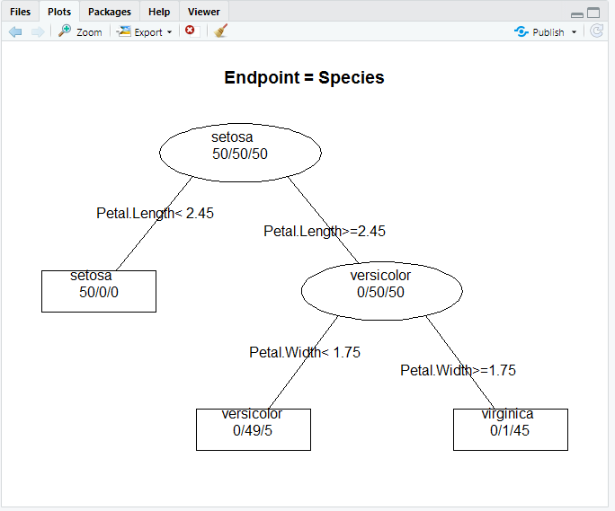

# R 10일차

## 1. 의사 결정 트리(Decision Tree)

- 의사 결정 트리(Decision Tree)

  - 나무(Tree) 구조 형태로 분류결과를 도출
  - 입력변수 중 가장 영향력 있는 변수를 기준으로 이진분류하여 분류 결과를 나무 구조 형태로 시각화
  - 비교적 모델 생성이 쉽고, 단순, 명료하여 현업에서 많이 사용되는 지도학습 모델
  - 의사결정규칙을 도표화 하여 분류와 예측을 수행하는 분석방법
  - party 패키지 ctree()
  - rpart 패키지 rpart()

  

  - party 패키지 ctree()  분류 결과 해석
  - 첫번째 번호는 반응변수(종속변수)에 대해서 설명변수(독립변수)가 영향을 미치는 중요 변수의 척도를 나타내는 수치로서 수치가 작을 수록 영향을 미치는 정도가 높고, 순서는 분기되는 순서를 의미한다.
  - 두번째는 의사결정 트리의 노드명 (노드 번호 뒤에 * 기호가 오면 해당 노드가 마지막 노드를 의미)
     노드명 뒤에 해당 변수의 임계값이 조건식으로 온다
  - 세번째는 노드의 분기 기준(criterion)이 되는 수치
  - 네번째는 반응변수(종속변수)의 통계량(statistic)이 표시된다. 

```R
install.packages("party")
library(party)
library(datasets)
str(airquality) # 관측 154개, 변수 6개

formula <- Temp ~ Solar.R+Wind+Ozone
air_ctree <- ctree(formula, data=airquality)
air_ctree
plot(air_ctree)
```


```R
#온도에 가장 큰 영향을 미치는 첫번째 영향변수는 Ozone
# 두번째 영향변수는 Wind
# 오존량 37이하이면서 바람의 양이 15.5이상이면 평균온도는 63정도에 해당
#바람의 양이 15.5이하인 경우 평균 온도는 70이상으로 나타남
#태양광은 온도에 영향을 미치지 않는 것으로 분석됨
```


## 2. iris 데이터 셋으로 분류 분석 수행

```R
set.seed(1234) # 시드값을 적용하면 랜덤 값이 동일하게 생성
idx <- sample(1:nrow(iris), nrow(iris)*0.7)
train <- iris[idx, ] # 학습 데이터
test <- iris[-idx, ] # -는 제외, 검정 데이터

# 종속변수는 Species, 독립변수는 나머지
formula <- Species ~ Sepal.Length + Sepal.Width + Petal.Length + Petal.Width #(~는 영향을 주는 요소)

#분류모델 생성
iris_ctree <- ctree(formula, data=train)
iris_ctree
plot(iris_ctree, type="simple")
```


```R
# 꽃종 분류에 가장 중요한 독립변수는? Petal.Length, Petal.Width

# 분류모델 평가 - 예측치 생성, 혼돈 매트릭스 생성

pred <- predict(iris_ctree, test)
table(pred, test$Species) # 예측값이 행, Species가 열

#분류 정확도 : ( 16 + 15 + 12) / nrow(test)
> ( 16 + 15 + 12) / nrow(test)
[1] 0.9555556 / 95.56%

> nrow(test)
[1] 45
```


## 3. k겹 교차 검증(k-fold cross validation)

```R
# 3겹, 2회 반복을 위한 샘플링
install.packages("cvTools")
library(cvTools)
cross <- cvFolds(nrow(iris), K=3, R=2)
str(cross)

cross #교차검정 데이터 확인
length(corss$which)
dim(cross$subsets)
table(cross$which)

R=1:2	#2회 반복
K=1:3	#k겹(3겹)
CNT=0	#카운트 변수
ACC <- numeric() #정확도 저장

for(r in R){
    cat('\n R=',r,'\n')
    for(k in K){
        datas_idx <- cross$subsets[cross$which=k, r]
        test <- iris[datas_idx, ] # test 데이터 생성
        cat('test:', nrow(test), '\n')
        
        formula <- Species ~ . # 나머지 모든 변수
        train <- iris[-dats_dix, ] # test행 뺀 훈련데이터
        cat('train:', nrow(train), '\n')
        
        model <- ctree(formula, data=train)
        pred <- predict(model, test)
        t <- table(pred, test$Species)
        print(t)
        CNT <- CNT+1
        ACC[CNT] <- (t[1,1]+t[2,2]+t[3,3])/sum(t)
        
    }
}
CNT #테스트 데이터 3셋 생성 모델, 예측 비교를 2번 반복, 즉 6회 수행
ACC #6회 수행 정확도 확인
#6회 정확도의 평균
mean(ACC, na.rm=T)

```

### 1. 연습문제1

```R
# 분류분석 연습문제
# ggplot2 :: mpg 데이터 셋
# model(모델), displ(엔진 크기), cyl(실린더 수), drv(구동 방식)
# 종속 변수 : 고속도로 주행거리(hwy)
# 고속도로 주행 거리에 가장 영향을 많이 미치는 요소 찾기

library(ggplot2)
data(mpg)
t <-sample(1:nrow(mpg), 120)
train <- mpg[t, ]
test <- mpg[-t, ]
test$drv <- factor(test$drv)  #구동방식 범주형 변환
formula <- hwy ~ disp+cyl+drv
hwy_ctree <- ctree(formula, data=test)
plot(hwy_ctree)

분석 결과 : 엔진 크기가 작으면서 전륜구동(f)이나 후륜(r) 구동 방식인 경우 고속도로 주행거리가 가장 좋고, 
엔진 크기가 크고, 사륜구동 방식이면 실린더 수가 많은 경우 고속도로 주행거리가 적은 것으로 분석된다.
```


### 2. 연습문제2

```R
install.packages("arules")
library(arules)
data("AdultUCI")
#성인 대상 인구 소득에 관한 설문 조사 데이터
#48,842 관측치와 15개변수
age, workclass(직업 :4개), education(교육수준: 16개), marital-status(결혼상태: 6개), occupation(직업:12개), relationship(관계: 6개), race(인종:아시아계, 백인), sex(성별), capital-gain(자본이득), capital-loss(자본손실), fnlwgt(미지의 변수), hours-per-week(주당 근무시간), native-country(국가), income(소득)

#10,000개 관측치를 샘플링해서
자본이득에 영향을 미치는 변수를 분석하기 위해 
capital-gain, hours-per-week, education-num, race, age, income 변수로만 구성된 데이터프레임을 생성한후 분류모델 생성하고 예측하시오

names(AdultUCI)
set.seed(1234)
choice <- sample(1:nrow(AdultUCI), 10000)
choice

adult.df <- AdultUCI[choice, ]
str(adult.df)

capital <- adult.df$'capital-gain'
hours <- adult.df$'hours-per-week'
education <- adult.df$'education-num'
race <- adult.df$race
age <- adult.df$age
income <- adult.df$income

adult_df <- data.frame(capital=capital, age=age , hours=hours,
    education=education, income=income)
str(adult_df)

formula <- capital ~ income+education+hours+age

adult_ctree <- ctree(formula, data=adult_df)

plot(adult_ctree)

#분석결과 : 자본이득(capital)에 가장 큰 영향을 미치는 변수는 income이고, 두번째는 education 변수이다.
수입이 많고 교육수준이 높을수록 자본이득이 많은 것으로 분석된다.

#분류 모델의 조건에 맞는 subset 생성
adultResult <- subset(adult_df, adult_df$income=='large' &  adult_df$education > 14)
length(adultResult$education)
summary(adultResult$capital) 
boxplot(adultResult$capital)

#income이 large이고 education이 14를 초과한 경우, 
자본이득 평균은 7,170
```


## 4. rpart 패키지 rpart()를 이용한 분류 분석

```R
install.package("rpart")
library(rpart)
data(iris)

iris.df <- rpart(Species ~., data=iris)
iris.df

plot(iris.df)
text(iris.df, use.n=T, cex=0.6)
post(iris.df, file="")

#줄기에 분기 조건
#끝 노드에는 반응변수의 결과값이 나타남
#꽃 종류 변수를 분류하는 가장 중요한 변수는 Petal.Length와 Petal.Width로 나타난다.
```



### 1. 연습문제3

```R
weather <- read.csv("./data/weather.csv", header=TRUE)

#RainTomorrow 컬럼을 종속변수로 
# 날씨 요인과 관련없는 Date와 RainToday컬럼을 제외한 나머지 변수를 x변수로 지정하여 분류 모델 생성하고 모델을 평가하시오

str(weather)
names(weather)
weather.df <- rpart(RainTomorrow ~ ., data=weather[, c(-1, -14)], cp=0.01) 
X11()
plot(weather.df)
text(weather.df, use.n=T, cex=0.7)

#분석 결과 : 분기조건이 True이면 왼쪽으로 분류되고, False
이면 오른쪽으로 분류된다.
#rpart()함수의 cp속성값을 높이면 가지 수가 적어지고, 낮추면 가지 수가 많아진다. cp 기본값은 0.01

weather_pred <- predict(weather.df , weather)
weather_pred

#y의 범주로 코딩 변환 : Yes(0.5이상), No(0.5미만)
#rpart의 분류모델 예측치는 비 유무를 0~1사이의 확률값으로 예측하다 
# 혼돈매트릭스를 이용하여 분류정확도를 구하기 위해 범주화 코딩 변경
weather_pred2 <- ifelse(weather_pred[,2] >= 0.5, 'Yes', 'No')
table(weather_pred2, weather$RainTomorrow)

#정확도 
(Yes인데 Yes로 측정값+No인데 No로 측정값) /nrow(weather)
```


## 5. Random Forest

```R
install.packages("randomForest")
library(randomForest)
data(iris)

model<-randomForest(Species~., data=iris)
model

#Number of trees는 학습데이터(Forest)로 복원 추출 방식으로 500개 생성했다는 의미
#No, of variables tried at each split는 두 개의 변수를 이용하여 트리의 자식노드가 분류되었다는 의미

#error.rate는 모델의 분류정확도 오차 비율을 의미
#Confusion matrix (혼돈 매트릭스 )..
#분류 정확도는 (setosa+versicolor+virginica) / 150 = 96%

model2<-randomForest(Species~., data=iris, ntree=300, mtry=4, na.action=na.omit)
model2

#중요변수 생성으로 랜덤 포레스트 모델 생성

model3<-randomForest(Species~., data=iris, importance=T, na.action=na.omit)
model3
#중요 변수 보기 - importance속성은 분류모델 생성하는 과정에서 입력변수 중 가장 중요한 변수가 어떤 변수인가를 알려주는 역할을 한다.

importance(model3)
#MeanDecreaseAccuracy - 분류정확도를 개선하는데 기여한 변수를 수치로 제공
 
#최적의 ntree, mtry 수치값 찾아내기
ntree <- c(400, 500, 600)
mtry <-c(2:4)
param <- data.frame(n=ntree, m=mtry)
param

for(i in param$n){
  cat('ntree=', i, '\n')
  for(j in param$m) {
     cat('mtry = ', j, '\n')
     model_iris <- randomForest(Species~. data=iris, ntree=i, mtry=j, na.action=na.omit)
     print(model_iris)
   }
}

#오차 비율을 비교하여 최적의 트리와 변수의 수를 결정합니다.
#(400, 2) (400, 3), (400, 4)
#(500, 2) (500, 3), (500, 4)
#(600, 2) (600, 3), (600, 4)
```

## 6. Simple 인공신경망 모델 생성 실습

```R
install.packages("nnet")
library(nnet)

df=data.frame(x2=c(1:6),
             x1=c(6:1),
             y=factor(c('no','no','no','yes','yes','yes')))
str(df)

# 인공신경망 모델 생성
model_net <- nnet(y~., df, size=1) 

# 결과는 5개의 가중치 생성, 오차는 점차적으로 줄어드는 결과를 확인할 수 있다.
model_net 
# 신경망(a 2-1-1)은 (경계값-입력변수-은닉층-출력변수)

summary(model_net) # 가중치 요약 정보 확인
# 입력층의 경계값(b) 1개와 입력변수(i1, i2)2개가 은닉층(h1)으로 연결되는 가중치
# 은닉층의 경계값(b) 1개와 은닉층의 결과값이 출력층으로 연결되는 가중치 

model_net$fitted.values  # 분류모델의 적합값 

#분류모델의 예측치 생성, 정확도 확인
#type="class"는 예측 결과를 출력변수 y의 범주('no','yes')로 분류
p <- predict(model_net, df, type="class")
table(p, df$y)
```

### 1. iris 데이터 셋에 인공신경망 모델 생성

```R
idx<-sample(1:nrow(iris), 0.7*nrow(iris))
training <- iris[idx, ]
testing <- iris[-idx, ]

model_net_iris <- nnet(Species ~ ., training, size=1)
#은닉층 1개, 11개의 가중치 , 출력값 3개


model_net_iris3 <- nnet(Species ~ ., training, size=3)
#은닉층 3개,  27개의 가중치, 출력값 3개

※ 입력변수의 값들이 일정하지 않으면 과적합(overfitting)을 피하기 위해서 정규화 과정을 수행해야 함.

#가중치 확인
summary(model_net_iris) 
summary(model_net_iris3)

#분류모델의 정확도 평가
table(predic(model_net_iris, testing, type="class").testing$Species)
#정확률은 
table(predic(model_net_iris3, testing, type="class").testing$Species)
#정확률은
```

### 2. iris 데이터 셋에 인공신경망 모델 생성: neuralnet 패키지

```R
install.packages("neuralnet")
library(neuralnet)
idx<-sample(1:nrow(iris), 0.7*nrow(iris))
training <- iris[idx, ]
testing <- iris[-idx, ]

※neuralnet()함수는 종속변수(출력변수y)가 수치형이어야 합니다.

training$Species2[training$Species=='setosa'] <- 1
training$Species2[training$Species=='versicolor'] <- 2
training$Species2[training$Species=='virginica'] <- 3
head(training)

testing$Species2[testing$Species=='setosa'] <- 1
testing$Species2[testing$Species=='versicolor'] <- 2
testing$Species2[testing$Species=='virginica'] <- 3
head(testing)

training$Species2 <- NULL
testing$Species2 <- NULL
# 정규화 함수를 이용하여 학습데이터와 검정데이터를 정규화
# 0과 1사이의 범위로 컬럼값을 정규화 
normal <- function(x){
     return ((x-min(x))/(max(x)-min(x)))
}

training_nor <- as.data.frame(lapply(training, normal))
summary(training_nor)

testing_nor <- as.data.frame(lapply(testing, normal))
summary(testing_nor)

#인공신경망 분류 모델 생성
model_net <- neuralnet(Species2 ~ Sepal.Length+ Sepal.Width+Petal.Length+Petal.Width, data=training_nor, hidden=1)
model_net
plot(model_net)

#분류모델 정확도(성능) 평가
model_result <- compute(model_net, testing_nor[c(1:4)])
model_result$net.result

#상관관계분석 : 상관계수로 두 변수 간의 선형관계의 강도 측정
#예측된 꼭 종류와 실제 관측치 사이의 상관관계 측정
cor(model_result$net.result, testing_nor$Species2)

#은닉층 2개
model_net2 <- neuralnet(Species2 ~ Sepal.Length+ Sepal.Width+Petal.Length+Petal.Width, 
               data=training_nor, hidden=2, algorithm="backprop", learningrate=0.01)
model_net2
plot(model_net2)


#분류모델 정확도(성능) 평가
model_result2 <- compute(model_net, testing_nor[c(1:4)])
model_result2$net.result
cor(model_result2$net.result, testing_nor$Species2)
```

### 3. 연습문제4

```R
# mpg 데이터 셋을 대상으로 7:3 비율로 학습데이터와 검정데이터로 각각 샘플링한 후
각 단계별로 분류분석을 수행하시오.
조건) 변수모델링 : x변수(displ + cyl + year), y변수(cty)

단계1 : 학습데이터와 검증데이터 샘플링
단계2 : formula 생성
단계3 : 학습데이터에 분류모델 적용
단계4 : 검정데이터에 분류모델 적용 
단계5 : 분류분석 결과 시각화 
단계6 : 분류분석 결과 해설 
```

### 4. 연습문제5

```R
04. weather 데이터를 이용하여 다음과 같은 단계별로 분류분석을 수행하시오.
조건1) rpart() 함수 이용 분류모델 생성
조건2) 변수 모델링 :
y변수(RainTomorrow), x변수(Date와 RainToday 변수 제외한 나머지 변수)
조건3) 비가 올 확률이 50% 이상이면 ‘Yes Rain’, 50% 미만이면 ‘No Rain’으로 범주화

단계1 : 데이터 가져오기
library(rpart)
weather = read.csv("./data/weather.csv", header=TRUE)
단계2 : 데이터 샘플링 
단계3 : 분류모델 생성 
단계4 : 예측치 생성 : 검정데이터 이용 
단계5 : 예측 확률 범주화('Yes Rain', 'No Rain')
단계6 : 혼돈 행렬(confusion matrix) 생성 및 분류정확도 구하기 
```

