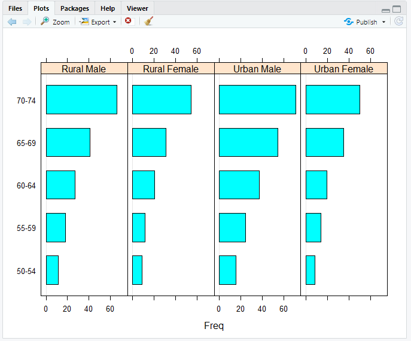

# R 12일차

## 1. 고급 시각화

### 1. 시각화 주요 패키지 : graphics, lattice, ggplot2, ggmap

- `lattice`패키지는 서로 상관있는 확률적 종속변수의 시각화에 사용
  - 특정 변수가 갖는 범주별로 독립된 패널을 격자(lattice)처럼 배치하여 사용
  - 여러 개의  변수에 대한 범주를 세부적으로 시각화해주는 도구를 제공
- `ggplot2`패키지는 기하학적 객체들(점, 선, 막대 등)에 미적특성(색상, 모양, 크기)을 적용하여 시각화하는 방법을 제공
- `ggmap`패키지는 지도 기반으로 위치, 영역, 시각과 공간에 따른 차이 및 변화를 다루는 공간시각화에 적합

#### 1. `lattice`

- `histogram()`
- `densityplot()` - 연속형변수 밀도 그래프
- `barchart()`
- `dotplot()`
- `xyplot()` - 교차 그래프
- `equal.count()`- 데이터셋에 지정된 영역만큼 범주화
- `coplot()` - 조건 변수와 관련 조건 그래프
- `cloud()` - 3차원 산점도

```R
install.packages("lattice")
library(lattice)

install.packages("mlmRev")
library(mlmRev)
data(Chem97)
#학생 대상 화확 점수를 기록한 데이터 셋

str(Chem97)  # data.frame':  31022 obs. of  8 variables:
#gcsescore : gcse개인평균성적
#lea : 지방교육청
table(Chem97$score)

head(Chem97,30) # 앞쪽 30개 레코드 

#  히스토그램 
histogram( ~ gcsescore, data=Chem97) 
# gcsescore변수를 대상으로 백분율 적용 히스토그램

histogram # histogram(~x축 | 조건, dataframe)
table(Chem97$score) #  0  2  4   6  8  10 <- 빈도수
# score 변수를 조건으로 지정 
histogram(~gcsescore | score, data=Chem97) # score 단위 
histogram(~gcsescore | factor(score), data=Chem97) # score 요인 단위

#  밀도 그래프 
densityplot(~gcsescore | factor(score), data=Chem97, 
            groups = gender, plot.points=T, auto.key = T) 
# 밀도 점 : plot.points=F
# 범례: auto.key=T
# 성별 단위(그룹화)로 GCSE점수를 밀도로 플로팅   


####막대 그래프 

# 1) 데이터셋 가져오기
data(VADeaths)  #사망연령대, 도시출신, 남녀
VADeaths
str(VADeaths)

# 2) 데이터셋 구조보기
mode(VADeaths) # numeric
class(VADeaths) # matrix

# 3) 데이터 리모델링
# (1) matrix -> data.frame 변환
df <- as.data.frame(VADeaths)
str(df) # 'data.frame':	5 obs. of  4 variables:
class(df) # "data.frame"
df 

# (2) matrix -> data.table 변환
dft <- as.data.frame.table(VADeaths)
str(dft) # 'data.frame':  20 obs. of  3 variables:
class(dft) # "data.frame"
dft # Var1  Var2 Freq -> 1열 기준으로 data.table 생성

# 막대 그래프 그리기 
barchart(Var1 ~ Freq | Var2, data=dft, layout=c(4,1))
# Var2변수 단위(그룹화)로 x축-Freq, y축-Var1으로 막대차트 플로팅

# 막대 그래프 그리기(origin 속성 사용)
barchart(Var1 ~ Freq | Var2, data=dft, layout=c(4,1), origin=0)
```



### 2. 이산변수 시각화 : barplot(), dotchart(), pie()

### 3. 연속변수 시각화 : boxplot(), hist(), plot()


