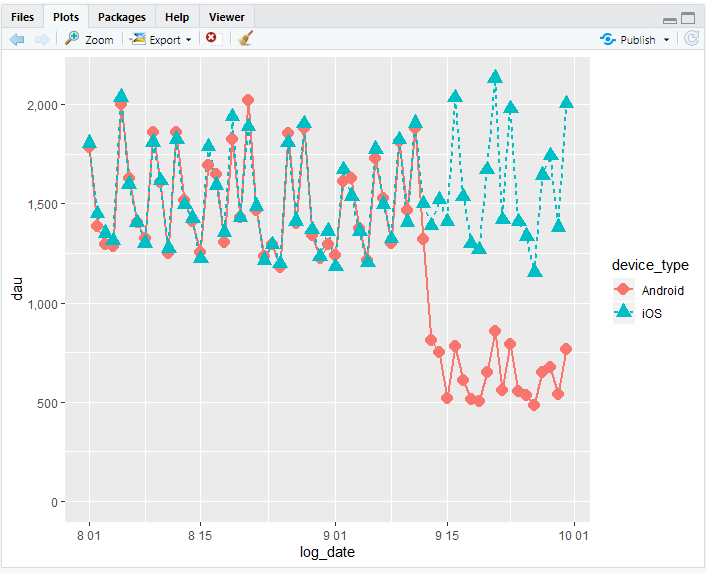
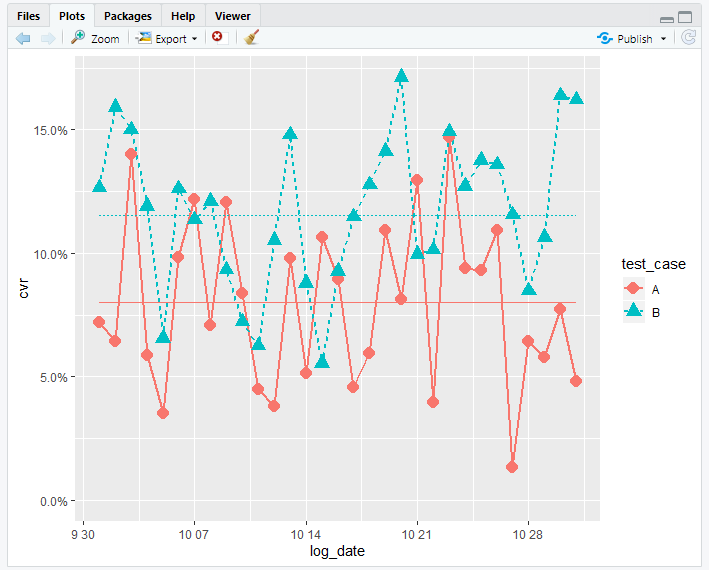

# R 14일차

## 1. 게임 데이터 로그 분석

```R
rm(list=ls())
# 1. 실행환경으로 데이터 로딩
dau <- read.csv('./workDatas/ws3-dau.csv')
head(dau)

user_info <- read.csv('./workDatas/ws3-user_info.csv')
head(user_info)
# 2. DAU데이터에 user_info 데이터 결합
dao.user.info <- merge(dau, user_info, by = c("user_id", "app_name"))
head(userDao)

# 2.5 month 추가하기

dao.user.info$log_month <- substr(dao.user.info$log_date, 1, 7)
tail(dao.user.info)
# 3. 세그먼트 분석
table(dao.user.info[, c("log_month","gender")]) # 성별로 집계
table(dao.user.info[ ,c("log_month", "generation")]) # 연령대별 집계
library(reshape2)
setRepositories()
install.packages("plyr")
library(plyr)

dcast(dao.user.info, log_month ~ gender + generation, 
      value.var = "user_id",length)

dau.user.info.device.summary <- ddply(dao.user.info, .(log_date, device_type), summarize, dau = length(user_id))

# 날짜별 데이터 형식으로 변환하기

dau.user.info.device.summary$log_date <- as.Date(dau.user.info.device.summary$log_date)


library(ggplot2)
library(scales)

limits <- c(0,max(dau.user.info.device.summary$dau))
    

ggplot(dau.user.info.device.summary, aes(x=log_date, y=dau, col=device_type, lty=device_type, shape=device_type)) +
  geom_line(lwd=1) +
  geom_point(size=4) +
  scale_y_continuous(label=comma, limits=limits)
```




## 2. 배너광고 반응 비교 검증

```R
# ab.test.imp 데이터에 ab.test.goal 데이터를 결합시키기
# 데이터를 읽어들이기
ab.test.imp <- read.csv("./data/ab_test_imp.csv",header=T, stringsAsFactors=F)
ab.test.goal <- read.csv("./data/ab_test_goal.csv",header=T, stringsAsFactors=F)
# ab.test.imp에 ab.test.goal를 결합시키기
ab.test.imp <- merge(ab.test.imp, ab.test.goal, by="transaction_id", all.x=T, suffixes=c("",".g"))
head(ab.test.imp)


# 클릭 플래그를 추가
ab.test.imp$is.goal <- ifelse(is.na(ab.test.imp$user_id.g),0,1)
head(ab.test.imp)

 
# 클릭율을 계산하기
library(plyr)
ddply(ab.test.imp, .(test_case), summarize,
cvr=sum(is.goal)/length(user_id))

# χ2 검정을 실행하기
chisq.test(ab.test.imp$test_case, ab.test.imp$is.goal)

 
# 날짜별, 테스트 케이스별로 클릭율을 산출하기
ab.test.imp.summary <-
ddply(ab.test.imp, .(log_date, test_case), summarise,
imp=length(user_id),
cv=sum(is.goal),
cvr=sum(is.goal)/length(user_id))

# 테스트 케이스별로 클릭율을 산출하기
ab.test.imp.summary <-
ddply(ab.test.imp.summary, .(test_case), transform,
cvr.avg=sum(cv)/sum(imp))
head(ab.test.imp.summary)

# 테스트 케이스별 클릭율의 시계열추이 그래프
library(ggplot2)
library(scales)

ab.test.imp.summary$log_date <- as.Date(ab.test.imp.summary$log_date)
limits <- c(0, max(ab.test.imp.summary$cvr))
ggplot(ab.test.imp.summary,aes(x=log_date,y=cvr, col=test_case,lty=test_case, shape=test_case)) +
geom_line(lwd=1) +
geom_point(size=4) +
geom_line(aes(y=cvr.avg,col=test_case)) +
scale_y_continuous(label=percent, limits=limits)
```



## 3. 매스미디어 광고 실시의 최적화

```R
ab.test.imp <- read.csv("./abData/ab_test_imp.csv")
ab.test.goal<-read.csv("./abData/ab_test_goal.csv")

ab.test.imp <- merge(ab.test.imp, ab.test.goal, by="transaction_id", all.x=T, suffixes=c("",".g"))
head(ab.test.imp)

ab.test.imp$is.goal <- ifelse(is.na(ab.test.imp$user_id.g), 0, 1)

ddply(ab.test.imp,
      .(test_case),
      summarize,
      cvr=sum(is.goal)/length(user_id))

ad.result <- read.csv("./data/ad_result.csv")
head(ad.result)


plot(ad.result$tvcm, ad.result$install, xnames="TV 광고비용", ynames="신규 유저수")
plot(ad.result$magazine, ad.result$install)

ggplot(ad.result,aes(x=magazine,y=install))+geom_point()+xlab('잡지 광고비')+ylab('신규유저수')+scale_x_continuous(label=comma)+scale_y_continuous(label=comma)
ggplot(ad.result, aes(x=tvcm, y=install))+geom_point()+xlab('TV 광고비')+ylab('신규 유저수')+scale_x_continuous(label=comma)+scale_y_continuous(label=comma)

fit <- lm(install~.,data=ad.result[ , c('install','tvcm','magazine')])
fit

summary(fit)
```


```R
Call:
lm(formula = install ~ ., data = ad.result[, c("install", "tvcm", 
    "magazine")])

Coefficients:
(Intercept)         tvcm  
    188.174        1.361  
   magazine  
      7.250  

> summary(fit)

Call:
lm(formula = install ~ ., data = ad.result[, c("install", "tvcm", 
    "magazine")])

Residuals:
     Min       1Q   Median       3Q      Max 
-1406.87  -984.49   -12.11   432.82  1985.84 

Coefficients:
             Estimate Std. Error t value
(Intercept)  188.1743  7719.1308   0.024
tvcm           1.3609     0.5174   2.630
magazine       7.2498     1.6926   4.283
            Pr(>|t|)   
(Intercept)  0.98123   
tvcm         0.03390 * 
magazine     0.00364 **
---
Signif. codes:  
0 ‘***’ 0.001 ‘**’ 0.01 ‘*’ 0.05 ‘.’ 0.1 ‘ ’ 1

Residual standard error: 1387 on 7 degrees of freedom
Multiple R-squared:  0.9379,	Adjusted R-squared:  0.9202 
F-statistic: 52.86 on 2 and 7 DF,  p-value: 5.967e-05
```

## 4. 게임 단말기  피처폰에서 스마트폰으로  이용 분석

```R
단계 1: CSV 파일 읽기
dau <- read.csv("./data/ws6-dau.csv", header = T, stringsAsFactors = F)
head(dau)

단계 2: 유저별로 ID 이전을 한 유저인지 아닌지 나타내는 데이터 정리
mau <- unique (dau[, c("region_month", "device", "user_id")])
fp.mau <- unique (dau[dau$device=="FP", c("region_month", "device",
"user_id")])
sp.mau <- unique (dau[dau$device=="SP", c("region_month", "device",
"user_id")])

# 1월과 2월 데이터를 나누기
fp.mau1 <- fp.mau[fp.mau$region_month == "2013-01", ]
fp.mau2 <- fp.mau[fp.mau$region_month == "2013-02", ]
sp.mau1 <- sp.mau[sp.mau$region_month == "2013-01", ]
sp.mau2 <- sp.mau[sp.mau$region_month == "2013-02", ]
# 1월에 피쳐폰으로 이용했던 유저가 2월에도 이용했는가
mau$is_access <- 1
fp.mau1 <- merge(fp.mau1, mau[mau$region_month == "2013-02",
c("user_id", "is_access")], by = "user_id", all.x = T)
fp.mau1$is_access[is.na(fp.mau1$is_access)] <- 0
head(fp.mau1)


# 1월에 피쳐폰으로 이용했고 2월에도 피쳐폰으로 이용했는가
fp.mau2$is_fp <- 1
fp.mau1 <- merge(fp.mau1, fp.mau2[, c("user_id", "is_fp")],
by = "user_id",
all.x = T)
fp.mau1$is_fp[is.na(fp.mau1$is_fp)] <- 0
head(fp.mau1)


# 1월에는 피쳐폰으로 이용하다가 2월에는 스마트폰으로 이용했는가
sp.mau2$is_sp <- 1
fp.mau1 <- merge(fp.mau1, sp.mau2[, c("user_id", "is_sp")],
by = "user_id", all.x = T)
fp.mau1$is_sp[is.na(fp.mau1$is_sp)] <- 0
head(fp.mau1)


# 1월에는 피쳐폰으로 이용했는데 2월에는 이용하지 않았거나 혹은 스마트폰으로 이용한 유저
fp.mau1 <- fp.mau1[fp.mau1$is_access == 0 | fp.mau1$is_sp == 1, ]
head(fp.mau1)


단계 3: 날짜별 게임 이용 상황 데이터 정리
library(reshape2)
fp.dau1 <- dau[dau$device == "FP" & dau$region_month == "2013-01", ]
fp.dau1$is_access <- 1
fp.dau1.cast <- dcast(fp.dau1, user_id ~ region_day, value.var =
"is_access", function(x) as.character(length(x)))
names(fp.dau1.cast)[-1] <- paste0("X", 1:31, "day")
head(fp.dau1.cast)

# 2월에 스마트폰으로 이용한 유저 데이터를 결합하기
fp.dau1.cast <- merge(fp.dau1.cast, fp.mau1[, c("user_id", "is_sp")],
by = "user_id")
head(fp.dau1.cast)
table(fp.dau1.cast$is_sp)


단계 4: 로지스틱 회귀분석을 통한 모델 작성
fit.logit <- step(glm(is_sp ~ ., data = fp.dau1.cast[, -1],
family = binomial))
summary(fit.logit)


단계 5: 작성된 모델을 이용해서 예측하기
# SP(스마트폰) 이전 확률
fp.dau1.cast$prob <- round(fitted(fit.logit), 2)
# SP(스마트폰)으로 이전할 지 예측
fp.dau1.cast$pred <- ifelse(fp.dau1.cast$prob > 0.5, 1, 0)
head(fp.dau1.cast)


단계 6: 예측결과로부터 유저 군 추측하기
# 예측과 실제
table(fp.dau1.cast[, c("is_sp", "pred")])

# 예측결과로부터 유저군을 추측하기
fp.dau1.cast1 <- fp.dau1.cast[fp.dau1.cast$is_sp == 1 & fp.dau1.cast$pred
== 1, ]
head(fp.dau1.cast1[order(fp.dau1.cast1$prob, decreasing = T), ])

fp.dau1.cast2 <- fp.dau1.cast[fp.dau1.cast$is_sp == 0 & fp.dau1.cast$pred
== 1, ]
head(fp.dau1.cast2[order(fp.dau1.cast2$prob, decreasing = T), ])

fp.dau1.cast3 <- fp.dau1.cast[fp.dau1.cast$is_sp == 0 & fp.dau1.cast$pred
== 0, ]
head(fp.dau1.cast3[order(fp.dau1.cast3$prob), ])
```

- 정답을 포함한 데이터가 없이 모델 세우기
  - 비지도학습(Unsupervised Learning)
    - 군집학습, 연관분석
    - neural network(인공 신경망)