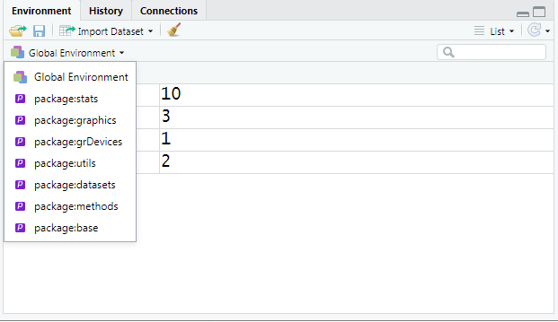
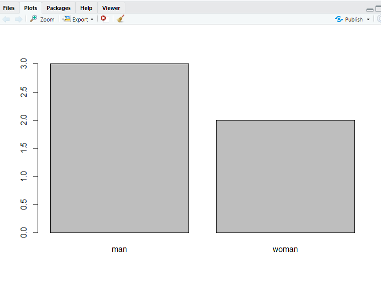
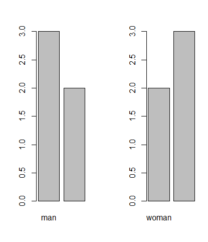

# R 1일차

> - R은 객체지향 프로그래밍 언어 - 데이터, 함수, 차트등 모든 데이터는 객체 형태로 관리
> - R은  통계 분석과 data의 시각화를 소프트웨어 환경
> - R은  데이터분석에 필요한 최신 알고리즘, 방법론등의 패키지의 집합이다
> - R은  data의 시각화를 위한 다양한 그래픽 도구를 제공
> - R은 모든 객체는 메모리로 로딩되어 고속으로 처리되고 재사용 가능

### 1. 설치 방법

```주소
www.r-project.org - https://cran.seoul.go.kr/
R-Window버전 다운로드
Default값으로 다운, 32-bit은 뺀다.

편리한 R 프로그래밍을 위해 R-studio를 설치
구글에 치면 잘 나온다.
Desktop버전 설치 - 설치 내용은 모두 Default값
```

### 2. 설정

```정보
Tools > Global setting > General 에서 기본 폴더 경로 세팅해주기
인코딩 default값은 CP949이다. -> UTF-8로 변경해주기
Pane layout에서 배치설정을 변경할 수 있다.
R패키지는 기본으로 설정되는 것도 있고, 아니면 import해서 사용해야 한다.
```




### 3. R패키지 확인하는 함수

```R
dim(available.packages())
available.packages()
```

- `R session`은 사용자가 R 프로그램을 시작한 후 R콘솔 시작 ~ 종료까지의 `sessioninfo()`
- R 프로그램 버전, 운영체제 정보, 다국어 지원현황, 기본 설치 된 R패키지 정보 출력

- 설치된 R패키지 목록 확인

```R
installed.packages()
```

### 4. R패키지 설치

```R
install.packages("stringr")
//update.packages("stringr")
remove.packages("stringr")

* R프로그램에서의 패키지설치와 RStudio에서의 패키지설치는 경로가 다르니 주의할 것
```

### 5. 설치된 패키지를 사용하기 위해서 메모리에 로드

```R
library(stringr) 또는 require(stringr)
```

### 6. 메모리에 로드된 패키지 검색

```R
search()
```

### 7. 기본 데이터 셋 보기

```R
data()
```

### 8. 빈도수 히스토그램

```R
hist(Nile)
```

### 9. 밀도 기준 히스토그램

```R
hist(Nile, freq=F)
```

### 10. 분포곡선 그리기

```R
lines(density(Nile))
```

### 11. Plots영역에 표시할 그래프 개수 설정

```R
par(mfrow=c(1,1))
```

### 12. 파일 출력 경로

```R
pdf("c:/Rworkspace/sample.pdf")
```

### 13.  정규분포를 따르는 난수 20개 생성해서 히스토그램 생성

```R
hist(rnorm(20))
```

### 14. 출력 파일 닫기

```R
dev.off()
```

### 15. 변수선언

- 첫문자는 영문자로 시작
- 두번째 문자부터는 숫자, _, . 사용 가능
- 대소문자 구분
- 예약어 사용 불가
- 변수에 저장된 값은 불변

```R
x<-3
tracemem(x)
x<-'a'
tracemem(x)

*'새로운' 주소값 할당
*`R`은 변수를 선언할 때 `자료형(Type)`을 선언하지 않는다.
```

### 16. 데이터 타입

- `Scala` 변수 - 단일 값(하나의 값)을 저장하는 변수

```R
age <- 30

age변수는 하나의 값을 저장하고 있는 벡터 타입
`벡터(Vector)`는 하나 이상의 여러 개의 자료를 저장할 수 있는 1차원의 선형 자료 구조

class(age)
[1] "numeric"

age <- "29"
class(age)
[1] "character"

age <- TRUE #상수객체(TRUE, FALSE)
class(age)
[1] "logical"

#T변수에 TRUE 저장, F변수에 FALSE 저장
age <- F
class(age)
[1] "logical"

age <- NA #결측치 (Not Available)
class(age+10)
[1] "numeric"

age <- null # Error: object 'null' not found
class(age+10)

sum(10,20,30)
[1] 60
sum(10,20,30,NA) 
[1] NA
sum(10,20,30,NA, na.rm=T)
[1] 60
*na.rm=T NA를 remove를 True로 하겠다.
```

### 17. R session에서 생성한 변수 목록 확인

```R
ls()
```

### 18. 자료형 확인

```R
is.numeric(변수)
is.logical(변수)
is.character(변수)
is.na(변수)
is.list(객체)
is.data.frame(객체)
is.array(객체)
is.matrix(객체)
```

### 19. 자료형 형변환

```R
as.numeric(변수)
as.logical(변수)
as.character(변수)
as.na(변수)
as.list(객체)
as.data.frame(객체)
as.array(객체)
as.matrix(객체)
as.integer(변수)
as.double(변수)
as.complex(변수) #복소수
as.factor(객체) #범주자료형
as.Date(객체) #날짜자료형

x<-c("1","2","3") # Vector생성
result <- x*3 
Error in x * 3 : non-numeric argument to binary operator
result <- as.numeric(x) * 3
3, 6, 9
result <- as.integer(x) * 3


z<-5.3-3i # 복소수 자료형 생성
class(z)
Re(z) # 실수만
[1] 5.3
Im(z) # 허수부만
[1] -3
is.complex(z)
[1] TRUE
as.complex(5.3)
[1] 5.3+0i

*class(변수)는 자료구조의 Type을 반환
*mode(변수)는 자료의 Type을 반환

> age <- "29"
> mode(age)
[1] "character"
> age <- TRUE #상수객체(TRUE, FALSE)
> mode(age)
[1] "logical"
> age <- F
> mode(age)
[1] "logical"
> age <- NA #결측치 (Not Available)
> mode(age)
[1] "logical"
```

- 작업 디렉터리 설정

```R
setwd("디렉터리명")
```

- `print()` 함수는 1번에 1가지만 출력, `cat()` 함수는 숫자와 문자 여러 개를 한번에 출력
- 여러 개의 명령을 연속적으로 실행하고 싶을 경우에 세미콜론(;)을 사용

```R
print(3,4)
cat(1, 'a', 2, 'b')
1+2 ; 3*2; 4/2
```

### 20. 연산자

#### 1. 산술연산자

- / 나누기 (실수 가능)
- %/% 정수 나누기
- %% 나머지 구하기
- ^, ** 승수 구하기

#### 2. null

- NULL은 NULL 객체를 뜻하며, 변수가 초기화되지 않았을 때 사용한다.

```R
is.null(변수)
```

#### 3. 문자열, 진리값

- 문자열

```R
a <- "hello"
print(a)
a <- 'hello'
print(a)
```

- 진리값
  - TRUE, T는 모두 참 값을 의
  - FALSE, F는 거짓 값을 의미
  - 진릿값에는 &(AND), |(OR), !(NOT) 연산자를 사용할 수 있다.
  - TRUE와 FALSE는 예약어`reserved word`고 T, F는 각각 TRUE와
    FALSE로 초기화된 전역 변수다.

```R
TRUE & TRUE
TRUE & FALSE
TRUE | TRUE
TRUE | FALSE
!TRUE
!FALSE
T <- FALSE
TRUE <- FALSE #Error in TRUE <- FALSE : invalid (do_set) left-hand side to assignment
c(TRUE, TRUE) & c(TRUE, FALSE)
[1]  TRUE FALSE
c(TRUE, TRUE) && c(TRUE, FALSE)
[1] TRUE
```

#### 4. 날짜와 시간

```R
Sys.Date() # 날짜만 보여주는 함수
Sys.time() # 날짜와 시간을 보여주는 함수
date() # 미국식 날짜와 시간을 출력하는 함수
as.Date(‘2017-12-01’) # 문자형태의 날짜를 날짜타입으로 변환해주는 함수
as.Date('2017/07/04')
as.Date('04-07-2017') #오류
as.Date(‘2017-12-01’ , format=‘%d-%m-%Y’)
as.Date(10, origin=‘2017-12-01’) #주어진 날짜 기준으로 10일후의 날짜
as.Date(-10, origin=‘2017-12-01’) #주어진 날짜 기준으로 10일 이전 날짜
```

- `POSIXt` : 날짜를 년, 월, 일 로 표시하는 리스트형 클래스
- `POSIXct` : 날짜를 연속적인 데이터로 인식해서 1970년을 기준으로 초 단위로 계산
- `POSIXct` 은 R고급 과정에서 회귀분석 등을 할 때 주로 POSIXct를 많이 사용

```R
as.Date("2017-07-04 20:00:00 ")-as.Date("2017-07-04 18:30")
Time difference of 0 days
as.POSIXct("2017-07-04 20:00:00 ")-as.POSIXct("2017-07-04 18:30")
Time difference of 1.5 hours
```

### 21.  현재 로케일 정보 전체 확인

```R
Sys.setlocale(category="LC_ALL", locale="언어_국가")

Sys.setlocale(category="LC_ALL", locale="")
Sys.getlocale()

Sys.setlocale(category="LC_ALL", locale="Korean_Korea")
Sys.getlocale()

Sys.setlocale(category="LC_ALL", locale="English_US") 
Sys.getlocale()

Sys.setlocale(category="LC_ALL", locale="Japanese_Japan")
Sys.getlocale()

```

### 22. R에서 제공하는 기본 함수 사용 예제 보기

```R
example(seq)
```

### 23. 함수의 파라미터 형식 보기

```R
args(max)
```

### 24. 도움말

```R
help(mean)
?sum

??mean
```

### 25. Hadoop R 연동

#### 1. Factor형

- 범주형 데이터
- 여러 번 중복으로 나오는 데이터들을 각 값으로 모아서 대표 값을 출력해 주는 형태
- `stringsAsFactors=FALSE` 옵션은 대표값으로 정리하지 않고 중복되는 상태 그대로 사용하게 해줌
- 명목형(Nominal)과 순서형(Ordinal) 유형으로 분류
- 범주형Categorical 데이터(자료)를 표현하기 위한 데이터 타입
- 범주형 데이터 - 데이터가 사전에 정해진 특정 유형으로만 분류되는 경우
- 범주형 데이터는 또 다시 명목형`Nominal`과 순서형`Ordinal`으로 구분
- 명목형 데이터는 값들 간에 크기 비교가 불가능한 경우
- 순서형 데이터는 대, 중, 소와 같이 값에 순서를 둘 수 있는 경우

```R
gender <- c("man", "woman", "woman", "man", "man")
plot(gender)

Error in plot.window(...) : need finite 'ylim' values
In addition: Warning messages:
1: In xy.coords(x, y, xlabel, ylabel, log) : NAs introduced by coercion
2: In min(x) : no non-missing arguments to min; returning Inf
3: In max(x) : no non-missing arguments to max; returning -Inf
*plot은 수치형만 가능하기 때문에 error

> class(gender)
[1] "character"
> mode(gender)
[1] "character"

ngender <- as.factor(gender)
> class(ngender)
[1] "factor"
> mode(ngender)
[1] "numeric" # 빈도수 반환
> is.factor(ngender)
[1] TRUE

ngender#Levels속성에서 범주를 확인 (알파벳 순서?)

args(factor)#factor()함수의 매개변수 확인
ogender <- factor(gender, levels<=("woman", "man"), ordered=T)
ogender    #범주의 순서 확인

par(mfrow=c(1, 2)) # 순서형 factor생성
plot(ngender)
plot(ogender)
```





#### 2. Vector형

- R에서 가장 기본이 되는 자료구조, 1차원, 선형구조
- 요소의 접근은 변수 `[index첨자]`로 접근, 첨자 index는 1부터 시작
- 동일한 데이터타입만 저장 가능
- 백터 생성 함수 : `c()`, `seq()`, `rep()`
- 벡터 자료 처리 함수 : `union()`, `setdiff()`, `intersect()`...

```R
c(1:20)
1:20
c(1,1,2,3,3,3,4,5,5,5,5,5)
seq(1, 20)
seq(1, 20, 2) # 2씩 증가
rep(1:3, 3) # 1~3까지 3번 반복
[1] 1 2 3 1 2 3 1 2 3
rep(1:3, each=3) # 1~3까지 반복하는데 각각 3번
[1] 1 1 1 2 2 2 3 3 3

a <- c(1:5)
b <- a+1
c <- a*2
d <- rep(1:3, 3)
union(a, d)
setdiff(a, d)
intersect(a, d)
f <- c(33, -5, "4", 5:9) # 자료형이 혼합된 경우, 문자열이 혼합된 경우, 문자열로 자동 형변환

> class(f)
[1] "character"
> mode(f)
[1] "character"

a <- c(1:20)
a[3:10] # 벡터의 요소에 접근
[1]  3  4  5  6  7  8  9 10
a[c(3,10)] # a의 요소 안에서 3이랑 10에 접근
[1]  3 10
```

