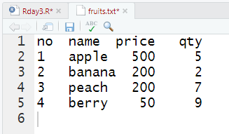

#  R 3일차

## 1. 복습

### 1. 벡터 요소 접근 방법

- `벡터객체[첨자]`
- `벡터객체[논리값]`
- 접근 요소 제외 : `벡터객체[-객체]`

### 2. 벡터 객체 집합 연산 내장 함수

- `intersect`
- `union`
- `setdiff`
- `identical`
- `setequal`

### 3. Matrix

- 벡터를 여러개 합친 것으로 2차원 구조의 데이터 저장소
- `rbind(row)`
- `cbind(column)` 
  - name을 정할때 `dimnames = , bynum= T`

- 타입이 다를 땐 요소의 개수가 동일해야 생성 됨
- 만약, 3열의 요소에만 접근하고 싶을 땐?
  - `matrix[ , 3] (행, 열)`

### 4. 행렬 객체 집합 연산 내장 함수

- 행렬곱 - `m객체 %*% n객체`
- 역행렬 - `solve(m 객체)`
- 전치 행렬 - `t(m 객체)`

### 5. Colnames(), Rownames()

- 이름을 바꿀 수 있는 함수

### 6. Array

- 다차원 데이터 저장소

- 인수 지정 
  - `array`(`데이터`, `디멘젼=(r,c,l)`)

### 7. List

- `key`, `value`로 구성

- `str()`
- `class()` - 형태 확인 하는 함수

- 데이터 접근
  - `list객체$key`

- 새로운 요소 추가
  - `list객체$New.key <- value`

- 요소 삭제
  - `list객체$New.key <- null`

- list를 벡터로 출력
  - `unlist()`

### 8. Dataframe

- RDBMS의 Table구조, Excel의 sheet 형태로 생긴 데이터 저장 구조

- subset
  - 조건식이 true인 데이터 프레임 요소 생성

- 두개의 Dataframe을 합칠 때
  - `merge`	 

- all = T

### 9. scan, readWrite

- 지금 하고 있는 데이터 파일 읽어올 때

### 10. read.csv 

- csv파일 읽어오기


## 2. 오늘자 진도

### 1. 헤더를 제외한 레코드 2개 skip(제외)하고, 2개의 record만 읽어오기

```R
fruits  <- read.table("./datas/fruits.txt", header=T, skip=2, nrows=2)
print(fruits )
str(fruits)
class(fruits)
```


### 2. R객체를 바이너리 파일로 저장 save(), load()

```R
str(fruits2)
save(fruits2, file="./output/fruits.RData")
```


### 3. XML 문서 읽어오기

```R
install.packages("XML")
library(XML)
data2 <- xmlParse(file="./data/emp.xml")
print(data2)
str(data2)

#ROOT NODE만 추출
rootnode <- xmlRoot(data2)
print(rootnode)
class(rootnode)
str(rootnode)

#rootnode의 자식 노드 갯수 
rootsize <- xmlSize(rootnode)
print(rootsize)

#rootnode의 첫번째 자식 노드 출력
print(rootnode[1])

#rootnode의 첫번째 자식 노드의 이름과 부서와 급여 출력
print(rootnode[[1]][[2]]);
print(rootnode[[1]][[3]]);
print(rootnode[[1]][[5]]);

#XML을 R의 지원형식인 data.frame으로 로딩
xmldataframe <- xmlToDataFrame("./datas/emp.xml")
print(xmldataframe)
str(xmldataframe)
```


### 4. JSON 파일 읽어오기 

```R
install.packages('rjson')
library(rjson)
rm(list=ls())
data1 <- fromJSON(file="./datas/emp.json") # json 파일로 저장하기
print(data1)
str(data1)

emp.dataframe<-as.data.frame(data1) # dataframe으로 만들기
print(emp.dataframe)
str(emp.dataframe)

fruits1 <- read.table("./datas/fruits.txt", header=T, stringsAsFactors = 2)
print(fruits1)
str(fruits1)
class(fruits1)

result <- toJSON(fruits1) # txt파일 json으로 변경 후 저장하기
print(result)
str(result)
write(result, "./output/fruits.json")
list.files("./output/")
```


### 5. HTML

- 개념 및 특징

  - ```
    httr 패키지는 지정한 url의 HTML소스를 가져오는 GET() 함수를 제공하고
    <table> 태그의 내용을 읽어올 수 있는 readHTMLTable()함수를 제공합니다.
    readHTMLTable()에 사용되는 속성 
    - get_url$content  : GET(url)함수에 의해서 가져온 HTML소스의 내용
    - rawToChar() : 바이너리(binary) 소스를 HTML 태그로 변환
    - stringsAsFactors = F : 문자열을 요인으로 처리하지 않고 순수한 문자열로 가져오기
    ```

- ```
  https://ssti.org/blog/useful-stats-capita-personal-income-state-2010-2015
  
  install.packages("httr")
  library(httr)
  url <- "https://ssti.org/blog/useful-stats-capita-personal-income-state-2010-2015"
  get_url <- GET(url)
  
  html_cont <- readHTMLTable(rawToChar(get_url$content), stringAsFactor=2)
  str(html_cont)
  class(html_cont)
  html_cont <- as.data.frame(html_cont)
  head(html_cont)
  str(html_cont)
  class(html_cont)
  names(html_cont) <- c("State", "y2010", "y2011", "y2012", "y2013", "y2014", "y2015")
  tail(html_cont)
  
             State   y2010   y2011   y2012   y2013
  47       Vermont $40,066 $42,735 $44,287 $44,839
  48      Virginia $45,412 $47,689 $49,320 $48,956
  49    Washington $42,821 $44,800 $47,344 $47,468
  50 West Virginia $32,104 $34,211 $35,374 $35,163
  51     Wisconsin $38,815 $40,837 $42,463 $42,737
  52       Wyoming $44,846 $49,140 $52,154 $51,791
       y2014   y2015
  47 $46,428 $47,864
  48 $50,345 $52,136
  49 $49,610 $51,146
  50 $36,132 $37,047
  51 $44,186 $45,617
  52 $54,584 $55,303
  ```


### 6. sink()

- 개념 :
  - 작업한 모든 내용이 파일에 저장

```R
sink("./output/R_processing.txt")
sink() # 오픈된 파일 close
```


### 7. write.table()

- R 스크립트에서 처리된 결과를 테이블 형식으로 저장할 수 있는 함수
  - row,names : 행번호를 제거하는 속성
  - quote : 따옴표 ㅔㅈ거

```R
library(xlsx)
studentx<-read.xlsx(file.choose(), sheetIndex=1, encoding='utf-8')
print(studentx)
str(studentx)
class(studentx)
write.table(students, "./output/std.txt") # 행번호, 따옴표 출력

write.table(students, "./output/std2.txt", row.names=FALSE, quote=FALSE)
```


### 8. 조건문

- 조건문 :` if(조건식) {참인 경우 처리문 } else { 거짓인 경우 처리문}`
- `ifelse(조건식, 참인 경우 처리문, 거짓인 경우 처리문)`
- `switch (비교문, 실행문1, 실행문2, 실행문3)` : 비교 문장의 내용에 따라서 여러 개의 실행 문장 중 하나를 선택which(조건)  : 벡터 객체를 대상으로 특정 데이터를 검색하는데 사용되는 함수
- `which()` 함수의 인수로 사용되는 조건식에 만족하는 경우 벡터 원소의 위치(인덱스)가 출력되며, 조건식이 거짓이면 0이 출력된다.
- `for(변수 in 변수) {실행문}` : 지정한 횟수만큼 실행문을 반복 수행
- `while(조건) { 실행문 }` : `while`블럭안에 증감식 포함

#### 1. if

```R
x<-
y<-
if(x*y >=30) {
cat("x*y의 결과는 30이상입니다.\n")
}else{
cat("x*y의 결과는 30미만입니다.\n")
}
```


	##### 1-1. 문제

```R
문) 사용자로부터 표준입력으로 점수를 입력받아서 학점을 출력하시오
#if(조건) { 실행문 } else if(조건) { 실행문장 }....else{실행문장}
score <- scan()
#점수 입력
#엔터
if(score>=90){
  result ="A학점"
}else if(score>=80){
  result ="B학점"
}else if(score>=70){
  result ="C학점"
}else if(score>=60){
  result ="D학점"
}else {
  result ="F학점"
}
cat("점수 ",score,"의 학점은 ", result)
```

```R
문) 사용자로부터 표준입력으로 정수를 입력받아서 짝수 또는 홀수 평가 
결과를 출력하시오
ifelse(number%%2==0, "짝수", "홀수")
```


#### 2. switch

```R
switch(비교문, 실행문1, 실행문2, 실행문3, ...)
비교문의 변수의 값이 실행문에 있는 변수와 일치할 때, 해당 변수에 할당 된 값이 리턴
switch("name", id="hong", pwd="1234", age=25, name="홍길동")

# 사원이름을 입력 받아서 해당 사원의 급여 출력
ename <- scan(what="")

print(ename)
switch(ename, hong=250, lee=300, park=350, kim=200)

names <- c("kim", "lee", "choi", "park")
which(names == "choi")

no<-c(1:5)
name<-c("홍길동", "이순신", "강감찬", "유관순", "김유신")
score<-c(85,90,78,74,80)
exam<-data.frame(학번=no, 이름=name, 성적=score)

문>which함수를 사용해서 유관순의 학번, 이름, 성적을 출력
print(exam[which(exam$이름=="유관순"), ])
```

#### 3. for문

```R
i<-c(1:10)
#짝수만 출력
for( n in i) 
  if(n%%2==0) print(n)


for( n in i) {
  if(n%%2==1) {
     next
   }else{
     print(n) 
  }
}
    
# 데이터 프레임에서 컬럼명 추출, 출력
    name <- c(names(exam))
for(n in name)
    print(n)
```


#### 4. while문

```R
문) while문으로 짝수 출력
i <- 0
while(i < 10){
  i<- i+1
  if(n%%2==0) print(n)
}
```


### 9. 함수

- 코드의 집합
- 함수명 <- function(매개변수) { 실행문 }

``` R
# 매개변수 없는 함수
f1 <- function(){
    cat("매개변수 없는 함수")
}
f1() # 함수 호출

# 매개변수가 있는 함수
f2 <- function(x) {
    if(x%%2==0) print(n)
}
f2(11) # 함수 호출

# 결과 반환 함수
f3 <- function(a, b) {
    add <- a+b
    return(add)
}
result <- f3(11, 4) # 함수 호출
print(result)
```


## 3. Error 해결하기

### 1. readTableHeader에 의하여 발견된 완성되지 않은 마지막 라인입니다

```R
> fruits  <- read.table("./datas/fruits.txt", header=T, skip=2, nrows=2)
Warning message:
In read.table("./datas/fruits.txt", header = T, skip = 2, nrows = 2) :
  './datas/fruits.txt'에서 readTableHeader에 의하여 발견된 완성되지 않은 마지막 라인입니다
```

- 읽어올 데이터파일의 마지막라인이 없을 경우 발생

  

- 현재 5줄까지 작성되어 있고 6줄은 없는 상태

  

- 6번째 줄 생성하고, 파일 다시 읽어오면 에러 해결


### 2. Package install Error

```R
Error in install.packages : ERROR: failed to lock directory ‘C:\Program Files\R\R-3.6.1\library’ for modifying
Try removing ‘C:\Program Files\R\R-3.6.1\library/00LOCK’
```

- 설치시 lock이 걸려 있던 것으로 추정
- `Lock00` 풀어주기
  - 단순히 폴더명을 제거하면 Rstudio 아예 안돌아간다

```R
unlink("C:/Program Files/R/R-3.6.1/library/00LOCK", recursive = TRUE)

install.packages("XML")
library(XML)
```

- 잘 돌아간다.