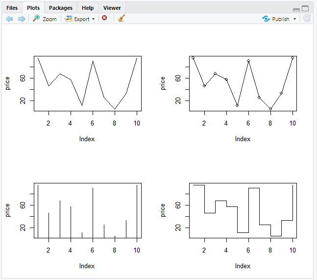
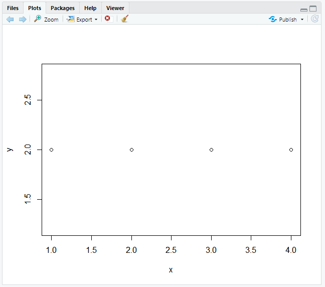
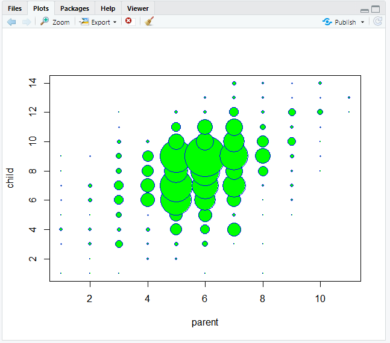
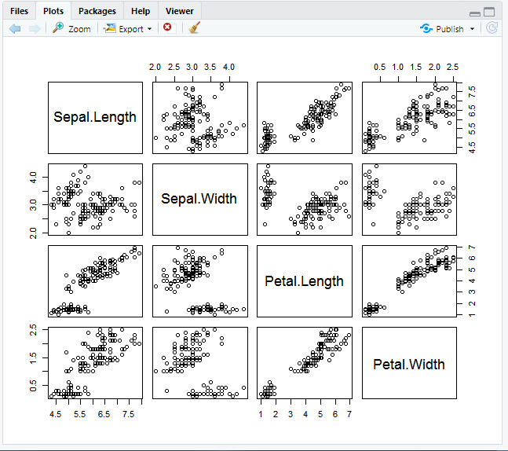
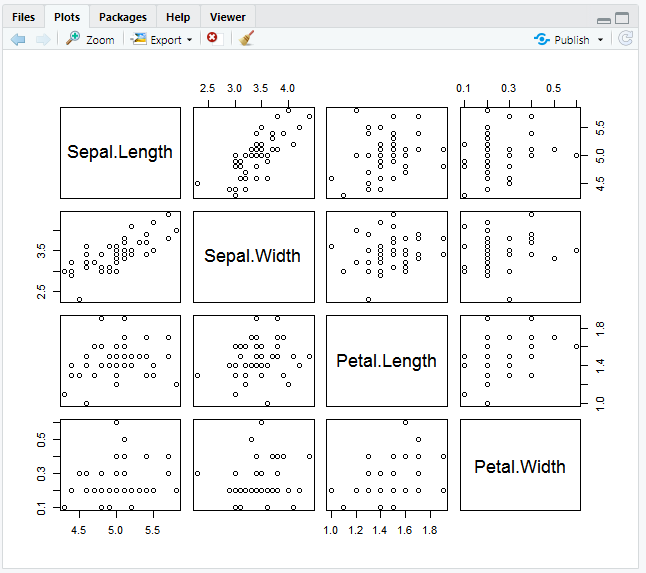
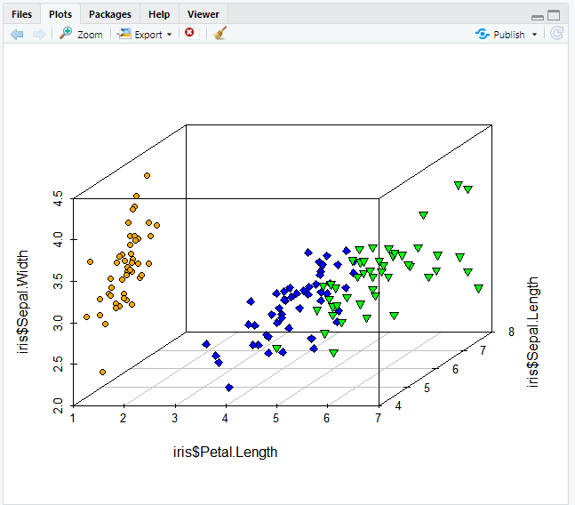
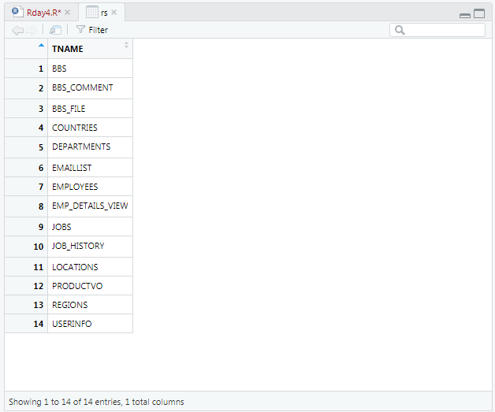
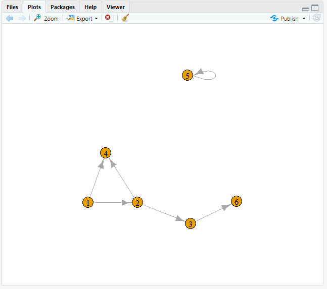

# R 4일차

## 1. 산점도

- 개념 : 
  - 두 개 이상의 변수들 사이의 분포를 점으로 표시한 차트
  - 두 변수의 관계를 시각적으로 분석할 때 유용

```R
price <- runif(10, min=1, max=100)
print(price)
plot(price, col="red")
par(new=T) #차트 추가
line_chart=1:100
#x축은 생성된 난수의 순서,  y축은 
plot(line_chart, type="l", col="red", axes=F, ann=F) #대각선 추가 
```




```R
#중복된 데이터의 수만큼 plot점 크기 확대
x<-c(1, 2, 3, 4, 2, 4)
y<-rep(2, 6)
table(x, y)  #빈도수


par(mfrow=c(1, 1))
plot(x, y)
```



```R
install.packages("psych")
library(psych)
data(galton)

#child컬럼, parent컬럼을 대상으로 교차테이블을 생성 결과를 데이터프레임으로 생성

galtondf <- as.data.frame(table(galton$child, galton$parent))
head(galtondf)
str(galtondf)

> head(galtondf)
  Var1 Var2 Freq(빈도수)
1 61.7   64    1
2 62.2   64    0
3 63.2   64    2
4 64.2   64    4
5 65.2   64    1
6 66.2   64    2

names(galtondf) <- c("child", "parent", "freq")
  child parent freq
1  61.7     64    1
2  62.2     64    0
3  63.2     64    2
4  64.2     64    4
5  65.2     64    1
6  66.2     64    2

parent <- as.numeric(galtondf$parent)
child<-as.numeric(galtondf$child)

plot(parent, child, pch=21, col="blue", bg="green",
     cex=0.2*galtondf$freq,xlab="parent", ylab="child")
```



## 2. `pairs()`

-  변수 간의 관계를 차트로 그릴 수 있다.

```R
attributes(iris)

$names
[1] "Sepal.Length" "Sepal.Width"  "Petal.Length"
[4] "Petal.Width"  "Species"     

$class
[1] "data.frame"

$row.names
  [1]   1   2   3   4   5   6   7   8   9  10  11
 [12]  12  13  14  15  16  17  18  19  20  21  22
 [23]  23  24  25  26  27  28  29  30  31  32  33
 [34]  34  35  36  37  38  39  40  41  42  43  44
 [45]  45  46  47  48  49  50  51  52  53  54  55
 [56]  56  57  58  59  60  61  62  63  64  65  66
 [67]  67  68  69  70  71  72  73  74  75  76  77
 [78]  78  79  80  81  82  83  84  85  86  87  88
 [89]  89  90  91  92  93  94  95  96  97  98  99
[100] 100 101 102 103 104 105 106 107 108 109 110
[111] 111 112 113 114 115 116 117 118 119 120 121
[122] 122 123 124 125 126 127 128 129 130 131 132
[133] 133 134 135 136 137 138 139 140 141 142 143
[144] 144 145 146 147 148 149 150
```

```R
pairs(iris[, 1:4])
```



```R
pairs(iris[iris$Species=="setosa", 1:4])
```



## 3. 3차원 산점도

`scatterplot3d(밑변, 오른쪽변 컬럼명, 왼쪽변 컬럼명)`

```R
install.packages("scatterplot3d")
library(scatterplot3d)
levels(iris$Species)
iris_setosa = iris[iris$Species=='setosa', ]
iris_versicolor = iris[iris$Species=='versicolor', ]
iris_virginica = iris[iris$Species=='virginica', ]
d3 <- scatterplot3d(iris$Petal.Length, iris$Sepal.Length,
      iris$Sepal.Width, type='n')  #type='n'은 기본 산점도를 표시하지 않음
```



## 4. 데이터 전처리 도구

- 데이터 분석 프로젝트에서는 70%이상의 시간을 데이터 변환과 조작, 필터링 등 전처리 작업에 소요

  - 데이터 전처리에 사용되는 유용한 패키지 : `plyr`, `dplyr`, `reshape`, `reshape2`패키지

  ### 1. `plyr`

- 두개 이상의 데이터프레임을 대상으로 key값을 이용하여 merge, 함수적용 , 요약 집계등의 기능을 제공

```R
install.packages("plyr")
library(plyr)
x<-data.frame(id=c(1,2,3,4,5), 
              height=c(160, 171, 173, 162, 165))
y<-data.frame(id=c(5, 1, 3, 2, 4), 
              weight=c(55, 73, 60, 57, 75))

# join() : 두 데이터프레임을 merge
xyjoin <- join(x, y, by="id")
xyjoin

> xyjoin
  id height weight
1  1    160     73
2  2    171     57
3  3    173     60
4  4    162     75
5  5    165     55

x<-data.frame(id=c(1,2,3,4,6), 
              height=c(160, 171, 173, 162, 165))
leftjoin <- join(x, y, by="id")   #왼쪽 데이터 프레임의 키값을 기준으로 merge
leftjoin    #키에 join할 데이터가 없으면 NA로 출력

> leftjoin    #키에 join할 데이터가 없으면 NA로 출력
  id height weight
1  1    160     73
2  2    171     57
3  3    173     60
4  4    162     75
5  6    165     NA


innerjoin <- join(x, y, by="id", type="inner")
innerjoin   #innerjoin은 두 데이터프레임에서 키값이 있는 경우에만 조인을 수행

> innerjoin   #innerjoin은 두 데이터프레임에서 키값이 있는 경우에만 조인을 수행
  id height weight
1  1    160     73
2  2    171     57
3  3    173     60
4  4    162     75

fulljoin <- join(x, y, by="id", type="full")
fulljoin   #키 값이 존재하는 전체 관측치를 대상으로 조인 수행, 키에 join할 데이터가 없으면 NA로 출력

> fulljoin   #키 값이 존재하는 전체 관측치를 대상으로 조인 수행, 키에 join할 데이터가 없으면 NA로 출력
  id height weight
1  1    160     73
2  2    171     57
3  3    173     60
4  4    162     75
5  6    165     NA
6  5     NA     55

x<-data.frame(key1=c(1,1, 2,2, 3), 
              key2=c('a', 'b', 'c','d', 'e'),
              val1 = c(10,20,30,40,50))

y<-data.frame(key1=c(3, 2, 2, 1, 1), 
              key2=c('e', 'd', 'c','b', 'a'),
              val1 = c(500,300,400,100,200))

xyjoin <- join (x, y, by=c(key1, key2))
xyjoin

> xyjoin
  id height weight
1  1    160     73
2  2    171     57
3  3    173     60
4  4    162     75
5  5    165     55
```

### 2. `ddply()`

- dplyr 패키지 -데이터 전처리( 조건 필터, 그룹핑,  함수적용, 변환, 집계연산, 정렬,.....)
- `filter()` 조건에 맞는 데이터셋 추출, 행추출
- `select()` 데이터 셋을 대상으로 컬럼을 선택하는 기능
- `mutate()` 데이터 넷의 새로운 컬럼을 추가하는 기능
- `arrange()` 데이터 셋의 특정 컬럼으로 정렬하는 기능
- `summarise()` 데이터 셋의 특정 컬럼으로 요약집계 기능

```R
#apply(vec, func) - 결과는 벡터, 배열, 리스트
#lapply(vec|list, func) - 결과는  리스트
#sapply(vec , func) - 결과는 벡터, 배열, 행렬 반환
#tapply() - 데이터 셋에 집단 변수(이산형 범주)를 대상으로 그룹별 함수 적용
#tapply(vec, 집단변수, 함수)

names(iris)
unique(iris$Species)
tapply(iris$Sepal.Length, iris$Species, mean)
sd_iris <- tapply(iris$Sepal.Length, iris$Species, sd)
str(sd_iris)


#ddply() - 데이터 셋에 집단 변수(이산형 범주)를 대상으로 그룹별 함수를 여러개  적용할 수 있습니다.
#ddply(데이터 셋, 집단변수, 요약집계, 컬럼명=함수(변수)) - 결과를 data.frame타입으로 반환

avg_df <- ddply(iris, .(Species), summarise, avg=mean(Sepal.Length))
avg_df
str(avg_df)

result <-ddply(iris, .(Species), summarise, avg=mean(Sepal.Length)
                 , std = sd(Sepal.Length), max=max(Sepal.Length),
                  min=min(Sepal.Length))
result
str(result)
```

```R

exam.csv#################################################################
id,class,math,english,science
1,1,50,98,50
2,1,60,97,60
3,1,45,86,78
4,1,30,98,58
5,2,25,80,65
6,2,50,89,98
7,2,80,90,45
8,2,90,78,25
9,3,20,98,15
10,3,50,98,45
11,3,65,65,65
12,3,45,85,32
13,4,46,98,65
14,4,48,87,12
15,4,75,56,78
16,4,58,98,65
17,5,65,68,98
18,5,80,78,90
19,5,89,68,87
20,5,78,83,58

exam<-read.csv("./datas/exam.csv")

print(exam)
str(exam)

# %>% 파이프 연산자 (다음 함수의 입력값으로 전달)
# class가 1인 record(행)추출
class1 <- exam %>% filter(class==1)
print(class1)

# class가 1을 제외한 record(행)추출
other_class <- exam %>% filter(class!=1)
print(other_class)

#class가 1이면서 수학점수는 50이상인 행을 추출
class1_math50 <- exam %>% filter(class==1 & math>50 )
print(class1_math50)

#class가 1,3,5인 행만 추출
odd_class <- exam %>% filter(class  %in% c(1, 3, 5) )
print(odd_class)

#영어점수 컬럼값만 추출
e_jumsu <- exam %>% select(english)
print(e_jumsu)

#수학점수 제외하고 모든 컬럼 추출
all_column <- exam %>% select(-math)
print(all_column)

#class가 1이면서 영어점수 컬럼값만 1행에서~3행까지 출력
print(exam %>% filter(class==1)  %>% select(english) %>% head(3))
  
#수학점수를 기준으로 오름차순 정렬된 결과를 변수에 저장하고 출력
asc_math <- exam  %>%  arrange(math) 
print(asc_math)

#수학점수를 기준으로 내림차순 정렬된 결과를 변수에 저장하고 출력
desc_math <- exam  %>%  arrange(desc(math))
print(desc_math)

# 1차 정렬은 class의 오름차순, 2차 정렬은 수학점수의 내림차순으로 정렬
order_math <- exam  %>%  arrange(class, desc(math))
print(order_math)

#총점(수학+영어+과학) 열을 추가
new_exam <- exam %>% mutate(total= math+english+science) 
print( new_exam )

#평균 열 추가
avg_exam <- exam  %>% mutate(total= math+english+science, 
                      mean=(math+english+science)/3 ) 
print( avg_exam )


#pass이름의 열을 추가 (평균이 60점이상이면 "pass"값, 
                      60점미만이면 "fail"값을 가짐)
pass <-  exam  %>% mutate(mean=(math+english+science)/3)   
           %>% mutate(pass=ifelse(mean >= 60 , "pass", "fail" ) ) 
print( pass )


#추가된 평균 컬럼으로 내림차순 정렬
avg_desc_exam <-  exam  %>% mutate(mean=(math+english+science)/3)  %>% arrange(mean)
print( avg_desc_exam)
```

### 3. `hflights`


### 4. RJDBC

- 개념 : 
  - OracleDB로부터 R실행환경(메모리)로 데이터 가져오기
  - RJDBC::JDBC("driver이름", "driver가 존재하는 클래스경로", "DB에서 문자열 처리")
  - `dbConnect(driver객체, DB_Url, user, password)`
  - `dbGetQuery(connection객체,  select sql문장)`

```R
install.packages("RJDBC")
library(RJDBC)
library(rJava)

drv <- JDBC("oracle.jdbc.OracleDriver",
            classPath="C:/app/student/product/11.2.0/dbhome_1/jdbc/lib/ojdbc6.jar",
            identifier.quote="'")

con <- dbConnect(drv, "jdbc:oracle:thin:@localhost:1521:orcl", "hr", "oracle")
rs <- dbGetQuery(con, "select tname from tab")
View(rs)
```



### 5. 관계도 : igraph()

```R
install.packages("igraph")
library(igraph)
g1 <- graph(c(1, 2, 2, 3, 2, 4, 1, 4, 5, 5, 3, 6))
print(g1)
plot(g1)
str(g1)
```

