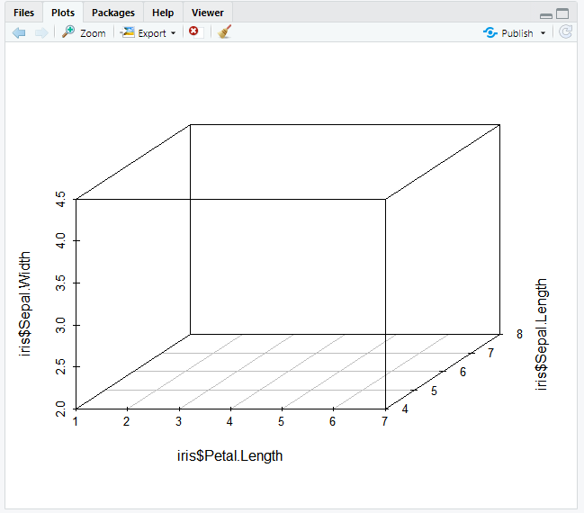

# R 4일차

## 1. 산점도

- 개념 : 
  - 두 개 이상의 변수들 사이의 분포를 점으로 표시한 차트
  - 두 변수의 관계를 시각적으로 분석할 때 유용

```R
price <- runif(10, min=1, max=100)
print(price)
plot(price, col="red")
par(new=T) #차트 추가
line_chart=1:100
#x축은 생성된 난수의 순서,  y축은 
plot(line_chart, type="l", col="red", axes=F, ann=F) #대각선 추가 
```


```R
#좌표평면상의 점 등을 선으로 연결
par(mfrow=c(2, 2))
plot(price, type="l")  #실선
plot(price, type="o")  #원형과 실선
plot(price, type="h")  #직선
plot(price, type="s")  #꺽은선
```


```R
#중복된 데이터의 수만큼 plot점 크기 확대
x<-c(1, 2, 3, 4, 2, 4)
y<-rep(2, 6)
table(x, y)  #빈도수


par(mfrow=c(1, 1))
plot(x, y)
```


```R
install.packages("psych")
library(psych)
data(galton)

#child컬럼, parent컬럼을 대상으로 교차테이블을 생성 결과를 데이터프레임으로 생성

galtondf <- as.data.frame(table(galton$child, galton$parent))
head(galtondf)
str(galtondf)

> head(galtondf)
  Var1 Var2 Freq(빈도수)
1 61.7   64    1
2 62.2   64    0
3 63.2   64    2
4 64.2   64    4
5 65.2   64    1
6 66.2   64    2

names(galtondf) <- c("child", "parent", "freq")
  child parent freq
1  61.7     64    1
2  62.2     64    0
3  63.2     64    2
4  64.2     64    4
5  65.2     64    1
6  66.2     64    2

parent <- as.numeric(galtondf$parent)
child<-as.numeric(galtondf$child)

plot(parent, child, pch=21, col="blue", bg="green",
     cex=0.2*galtondf$freq,xlab="parent", ylab="child")
```


## 2. `pairs()`

-  변수 간의 관계를 차트로 그릴 수 있다.

```R
attributes(iris)

$names
[1] "Sepal.Length" "Sepal.Width"  "Petal.Length"
[4] "Petal.Width"  "Species"     

$class
[1] "data.frame"

$row.names
  [1]   1   2   3   4   5   6   7   8   9  10  11
 [12]  12  13  14  15  16  17  18  19  20  21  22
 [23]  23  24  25  26  27  28  29  30  31  32  33
 [34]  34  35  36  37  38  39  40  41  42  43  44
 [45]  45  46  47  48  49  50  51  52  53  54  55
 [56]  56  57  58  59  60  61  62  63  64  65  66
 [67]  67  68  69  70  71  72  73  74  75  76  77
 [78]  78  79  80  81  82  83  84  85  86  87  88
 [89]  89  90  91  92  93  94  95  96  97  98  99
[100] 100 101 102 103 104 105 106 107 108 109 110
[111] 111 112 113 114 115 116 117 118 119 120 121
[122] 122 123 124 125 126 127 128 129 130 131 132
[133] 133 134 135 136 137 138 139 140 141 142 143
[144] 144 145 146 147 148 149 150
```

```R
pairs(iris[, 1:4])
```


```R
pairs(iris[iris$Species=="setosa", 1:4])
```


## 3. 3차원 산점도

`scatterplot3d(밑변, 오른쪽변 컬럼명, 왼쪽변 컬럼명)`

```R
install.packages("scatterplot3d")
library(scatterplot3d)
levels(iris$Species)
iris_setosa = iris[iris$Species=='setosa', ]
iris_versicolor = iris[iris$Species=='versicolor', ]
iris_virginica = iris[iris$Species=='virginica', ]
d3 <- scatterplot3d(iris$Petal.Length, iris$Sepal.Length,
      iris$Sepal.Width, type='n')  #type='n'은 기본 산점도를 표시하지 않음
```



