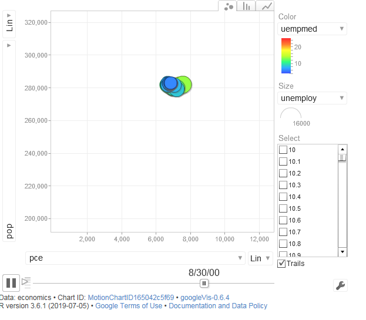
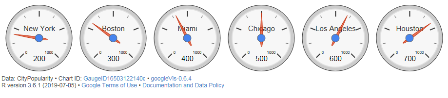

# R 6일차

## 1. 가격 비교를 위한 스크래핑

- `rvest` 패키지 : 웹 페이지에서 필요한 정보를 추출하는데 유용한 패키지
- `selectr`패키지, `xml2` 패키지가 의존 패키지이므로 함께 설치
- `read_html(url)` : 지정된 url에서 html 컨텐츠를 가져옴
- `jsonline` 패키지 : json 파서/생성기가 웹용으로 최적화되어 있는 패키지


```R
install.packages("jsonlite")
libary(jsonlite)
libary(xml2)
libary(rvest)
libary(stringr)

url <- 'https://www.amazon.in/OnePlus-Mirror-Black-64GB-Memory/dp/B0756Z43QS?tag=googinhydr18418-21&tag=googinkenshoo-21&ascsubtag=aee9a916-6acd-4409-92ca-3bdbeb549f80'

#추출할 정보 : 제목, 가격, 제품 설명, 등급, 크기, 색상

#웹 사이트로부터  HTML code 읽기
webpage <- read_html(url)

#제목 정보의 태그 가져오기
title_html <- html_nodes(webpage, 'h1#title')
title <- html_text(title_html)
head(title)

# 모든 공백과 줄 바꿈 제거
str_replace_all(title,"[\r\n]","")

#가격 정보 태그 가져오기
price_html <- html_nodes(webpage, 'span#priceblock_ourprice')
price <- html_text(price_html)

# 모든 공백과 줄 바꿈 제거
price <- str_replace_al(price, "[\r\n]", "")
head(price)

# 등급 정보 태그 가져오기
rate_html <- html_nodes(webpage, 'span # acrPopover')
rate<- html_text(rate_html)

# 모든 공백과 줄 바꿈 제거 
rate <- str_replace_all(rate, "[\r\n]","")
rate <- str_trim(rate)
head(rate)

# 크기 정보 가져오기
size_html <- html_nodes(webpage, 'div # variation_size_name')
size_html <- html_nodes(size_html, 'span.selection')
size <- html_text(size_html)

size<- str_trim(size)
head(size)

# 색상 정보 가져오기
color_html <- html_nodes(webpage, 'div # variation_color_name')
color_html <- html_nodes(color_html, 'span.selection')
color <- html_text(color.html)

color<-str_trim(color)
head(color)

# data.frame객체로 생성
product_data <- data.frame(Title=title, Price=price, Description=desc, Rate=rate, Size=size, Color=color)
str(product_data)

# JSON 형식으로 데이터 저장
library(jsonlite)
json_data<-toJSON(product_data)
cat(json_data)
```

## 2. googleVis 패키지

```R
install.packages("googleVis")
library(ggplot2)
library(googleVis)
motion <- gvisMotionChart(economics, idvar="psavert", timevar="date")
plot(motion)
```



```R
# global Environment 삭제하기
rm(list=ls())
```

```R
# gvisGauge(데이터 세트, labelvar ="측정 데이터", numvar="값", options=list(그래프 옵선))
```

```R
gauge <- gvisGauge(CityPopularity, labelvar="City", numvar="Popularity", options= list(min=0, max= 1000))
```



