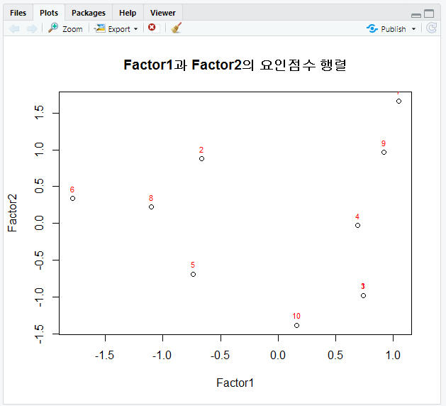
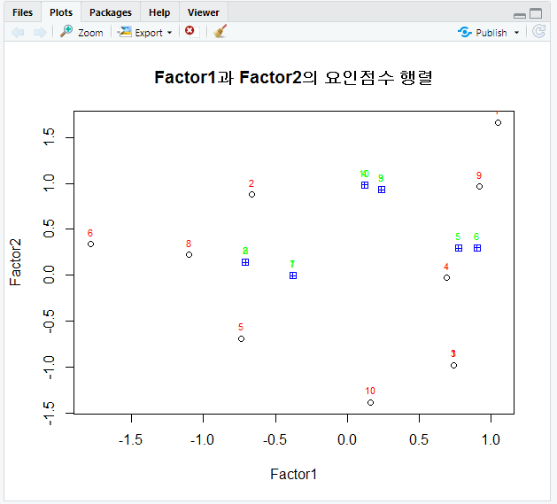
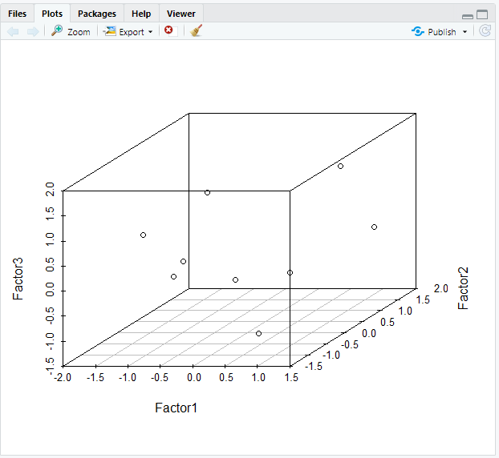

# R 9일차

### 1. 단일 집단을 대상으로 전. 후에 대해 표본 추출해서 비율의 차이 비교  검정 

- binom.test() (유의순준과 유의확률)

### 2.단일 집단을 평균이 어떤 특정한 집단의 평균과의 차이를 검정을 위해서 단일 집단의 평균이 정규분포를 이루는지 먼저 검정 

- shapiro.test()

### 3.단일 집단을 평균이 정규분포를 따르는 경우 

- t.test() (유의확률과 t검정통계량)

### 4.단일 집단을 평균이 정규분포를 따르지 않는 경우 

- wilcox.text()

### 5.두집단을 대상으로 비율 검정 

- (독립표본 이항분포 비율 검정) - prop.test()

### 6.두집단을 대상으로 평균 검정

- 두 집단의 평균의 정규분포가 동일한지 검정 (동질성 검정 -var.test() )

### 7.두 집단의 평균이 정규분포를 따르는 경우 

- t.test()

### 8.두 집단의 평균이 정규분포를 따르지 않는 경우 

- wilcox.text()

### 9.대응 두 집단 (예] 교수법 전, 교수법 후 동일 대상의 서로 다른 점수)의 평균 차이 비교
### 10.대응 두 집단의 평균의 정규분포가 동일한지 검정

- (동질성 검정 -var.test() )

### 11.대응 두 집단의 평균이 정규분포를 따르는 경우

- t.test()

### 12.대응 두 집단의 평균이 정규분포를 따르지 않는 경우 

- wilcox.text()

### 13.세 집단 대상으로 비율 검정 

- prop.test()

### 14.세 집단 대상으로 평균 검정

 - 분산분석, F검정

### 15.세 집단의 평균의 정규분포가 동일한지 검정

 (동질성 검정 - bartlett.test())

### 16.세 집단의 평균이 정규분포를 따르는 경우 

- aov()

### 17.세 집단의 정규분포를 따르지 않는 경우

- kruskal.test()

### 18.사후 검정 

- TukeyHSD()


### 19.요인 분석 

- 다수의 변수를 대상으로 변수간의 관계를 분석하여 결과를 이용하여
   상관분석이나 회귀분석의 설명변수(독립변수)로 활용하기 위해 수행하는 분석

- 변수의 주요 성분 분석 요인수를 알아보려면

1. 주성분 분석 - prcomp()
2. 고유값(변수의 상관계수 행렬)으로 요인수 분석 - eigen()

변수들간의 상관관계 분석으로 요인 분석 

- 변수들간의 상관성을 이용해서 공통요인 추출 factanal(dataset, factors="" , rotation="", scores="") 

```R
###########요인분석 결과 요인 점수를 이용한 요인 적재량 시각화 ##########
# 6개 과목 (s1~s6) 
# 점수벡터 (5점 만점, 척도:5)
s1 <- c(1, 2, 1, 2, 3, 4, 2, 3, 4, 5)  #자연과학
s2 <- c(1, 3, 1, 2, 3, 4, 2, 4, 3, 4)  # 물리화학
s3 <- c(2, 3, 2, 3, 2, 3, 5, 3, 4, 2)  #인문사회
s4 <- c(2, 4, 2, 3, 2, 3, 5, 3, 4, 1)  # 신문방송
s5 <- c(4, 5, 4, 5, 2, 1, 5, 2, 4, 3)  #응용수학
s6 <- c(4, 3, 4, 4, 2, 1, 5, 2, 4, 2)  # 추론통계
name <-1:10  #각 과목의 문제 이름

#데이터 프레임 생성
subject <- data.frame(s1, s2, s3, s4, s5, s6)
str(subject)
'data.frame':	10 obs. of  6 variables:
 $ s1: num  1 2 1 2 3 4 2 3 4 5
 $ s2: num  1 3 1 2 3 4 2 4 3 4
 $ s3: num  2 3 2 3 2 3 5 3 4 2
 $ s4: num  2 4 2 3 2 3 5 3 4 1
 $ s5: num  4 5 4 5 2 1 5 2 4 3
 $ s6: num  4 3 4 4 2 1 5 2 4 2

result <- factanal(subject, factors=3, rotation="varimax" , scores="regression")
result
Call:
factanal(x = subject, factors = 3, scores = "regression", rotation = "varimax")

Uniquenesses:
   s1    s2    s3    s4    s5    s6 
0.005 0.056 0.051 0.005 0.240 0.005 

Loadings:
   Factor1 Factor2 Factor3
s1 -0.379           0.923 
s2 -0.710   0.140   0.649 
s3  0.236   0.931   0.166 
s4  0.120   0.983  -0.118 
s5  0.771   0.297  -0.278 
s6  0.900   0.301  -0.307 

               Factor1 Factor2 Factor3
SS loadings      2.122   2.031   1.486
Proportion Var   0.354   0.339   0.248
Cumulative Var   0.354   0.692   0.940

The degrees of freedom for the model is 0 and the fit was 0.7745

plot(result$scores[, c(1:2)], main="Factor1과 Factor2의 요인점수 행렬")
text(result$scores[, 1], result$scores[, 2], labels = name, cex=0.7, pos=3, col="red")
```



```R
points(result$loadings[, c(1:2)], pch=12, col="blue")
text(result$loadings[, 1], result$loadings[, 2], labels = name, cex=0.7, pos=3, col="red")
```




### 20. scatterplot3d package

- `scatterplot3d(밑변, 오른쪽 변, 왼쪽 변, type)`
- `scatterplot3d(Factor1, Factor2, Factor3, type='p')`

#### 1. 요인적재량 표시

```R
loading1<-result$loadings[, 1]
loading2<-result$loadings[, 2]
loading3<-result$loadings[, 3]
d3$points3d(loadings1, loadings2, loadings3,bg="red",pch=21, cex=2, type="h")
```


#### 2. 요인 분석 결과를 이용하여 변수 묶기

- 상관분석이나 회귀분석
- Factor1은 응용과학, Factor2는 응용수학 ,Factor3은 자연과학

```R
app <- data.frame(subject$s5, subject$s6)
soc <- data.frame(subject$s3, subject$s4)
net <- data.frame(subject$s1, subject$s2)

# 산술평균을 계산하여 요인별 파생변수 생성
app_science <- round((app$subject.s5 + app$subject.s6/ncol(app), 2))
soc_science <- round((app$subject.s3 + app$subject.s4)/ncol(soc), 2)
net_science <- round((app$subject.s1 + app$subject.s2)/ncol(net), 2)

# 상관관계 분석
subject_factor_df <- data.frame(app_science,soc_science,net_science)
cor(subject_factor_df)

            app_science soc_science net_science
app_science   1.0000000  0.43572654 -0.68903024
soc_science   0.4357265  1.00000000 -0.02570212
net_science  -0.6890302 -0.02570212  1.00000000

해석 > '응용과학' 기분으로 '사회과학'은 양의 상관성을 나타내고, '자연과학'은 음의 상관성
```



#### 3.잘못 분류된 요인 제거로 변수 정제

```R
#음료수 제품의 11개의 변수 (친밀도, 적절성, 만족도 3가지 영역)
# 특정 변수가 묶일 것으로 예상되는 요인이 묶이지 않는 경우, 해당 변수를 제거하는 정제 작업이 필요합니다.
install.packages("memisc")
library(memisc)
data.spss <- as.data.set(spss.system.file("./data/drinking_water.sav"))
data.spss

# 제품 친밀도 (q1 : 브랜드, q2:친근감, q3:익숙함, q4:편안함)
# 제품 적절성 (q5 : 가격적절성, q6:당도적절성, q7:성분적절성)
# 제품 만족도 (q8 : 음료의 목넘김, q9:맛, q10:향 ,q11:가격)

drinking_water <- data.spss[1:11]  
drinking_water_df <- as.data.frame(data.spss[1:11])
str(drinking_water_df)

#요인 분석
result <- factanal(drinking_water_df, factors=3, rotation="varimax")

#Uniqueness는 11개변수가 0.5 이하의 값이면 모두 유효하다고 볼 수 있다.
#Loadings : Factor1 (q8~q11), Factor2(q1~q3), Factor3(q4~q7)
#p-value는 0.0255로 유의수준 0.05보다 작기 때문에 요인수 선택에 문제가 있다고 볼 수 있다
#(p-value는  chi_square 검정의 결과로서 기대치와 관찰치에 차이가 있음을 알려주는 확률값)

dw_df <-drinking_water_df[-4]
str(dw_df)

#요인별 변수 묶기
s <- data.frame(dw_df$q8, dw_df$q9, dw_df$q10, dw_df$q11)  #만족도
c <- data.frame(dw_df$q1, dw_df$q2, dw_df$q3)  #친밀도
p <- data.frame(dw_df$q5, dw_df$q6, dw_df$q7)  #적절성

#요인별 산술평균 계산
satisfaction <-round( (dw_df$q8+dw_df$q9+dw_df$q10+dw_df$q11)/ncol(s), 2)
closeness <-round( (dw_df$q1+dw_df$q2+dw_df$q3)/ncol(c), 2)
pertinence <-round( (dw_df$q5+dw_df$q6+dw_df$q7)/ncol(p), 2)

#상관관계 분석
dwf_df <- data.frame(satisfaction, closeness, pertinence)
colnames(dwf_df) <-c("제품 만족도", "제품 친밀도", "제품 적절성")
> cor(dwf_df)
            제품 만족도 제품 친밀도 제품 적절성
제품 만족도   1.0000000   0.4047543   0.4825335
제품 친밀도   0.4047543   1.0000000   0.6344751
제품 적절성   0.4825335   0.6344751   1.0000000

해석> 제품 친밀도와 제품 적절성이 상관관계가 높은 변수들임
```

#### 4. 상관관계분석 

```R
result <- read.csv("./datas/product.csv", header=TRUE)
head(result)
str(result)

summary(result)
sd(result$제품_친밀도); sd(result$제품_적절성); sd(result$제품_만족도)

cor(result$제품_친밀도, result$제품_적절성)
#0.4992086

cor(result$제품_적절성, result$제품_만족도)
#0.7668527

cor(result$제품_친밀도+result$제품_적절성, result$제품_만족도)
#0.7017394

cor(result, method="pearson")

#상관계수에 따라 색의 농도로 시각화
install.packages("corrgram")
library(corrgram)
corrgram(result)

corrgram(result, upper.panel=panel.conf) #위쪽에 상관계수 추가
corrgram(result, lower.panel=panel.conf) #아래쪽에 상관계수 추가

# 상관성, 밀도곡선, 유의확률 시각화
install.packages("PerformanceAnalytics")
library(PerformanceAnalytics)
# 상관성, p값(*), 정규분포 시각화
chart.Correlation(result, histogram=, pch="+")
```

#### 5. 회귀분석

```R
product <- read.csv("./data/product.csv", header=TRUE)
head(product)
str(product)

y<-product$제품_만족도  #종속변수
x<-product$제품_적절성  #독립변수
df <- data.frame(x, y)

# 단순 선형회귀 모델 생성 lm(y~x, data)
library(stats)
result.lm <- lm(formula=y~x, data=df)
result.lm

# Y=0.7789 +0.7393*X

# 생성된 선형회귀 모델의 적합값과 잔차 계산
names(result.lm)    #모델 관련 정보 확인
fitted.values(result.lm)[1:2]   #모델의 적합값 확인 3.735963, 2.996687
head(df, 1)   #관측값  x=4, y=3

Y=0.7789 +0.7393*4
Y     #3.7361

#오차는 관측값-적합값
3 - 3.735963     #-0.735963

residuals(result.lm)[1:2]  #-0.7359630, -0.9966869

#관측값은 잔차+ 적합값
-0.7359630 + 3.735963    #3

#선형회귀분석 모델 시각화
plot(formula=y~x, data=result)
abline(result.lm, col="red")   #회귀선

#선형회귀분석 결과
summary(result.lm)

# Multiple R-squared:  0.5881 는 독립변수에 의해서 종속변수가 얼마만큼 설명되었는가 (회귀모델의 설명력)
# Multiple R-squared 값은 독립변수와 종속변수 간의 상관관계를 나타내는 결정계수
# 설명력이 1에 가까울수록 설명변수(독립변수)가 설명을 잘한다고 판단할 수 있습니다. => 변수의 모델링이 잘 되었다는 의미

#Adjusted R-squared:  0.5865은 오차를 감안하여 조정된 R 값으로 (실제 분석은 이 값을 적용합니다.)

#F-statistic:   374 회귀모델의 적합성을 나타내며    
#p-value: < 2.2e-16 
#F-statistic와 p-value를 이용하여 회귀모델 자체를 신뢰할 수 있는지 판단
#p-value가 0.05보다 매우 작기 때문에 회귀선이 모델에 적합하다고 볼 수 있습니다.

#x            0.73928    0.03823  19.340  < 2e-16 ***
x변수의 t=19.340 , p-value는 < 2e-16 이므로  p-value가 0.05보다 매우 작기 때문에 "제품의 가격과 품질을 결정하는 제품 적절성은 제품 만족도에 양의 영향을 미친다." 연구가설 채택
```

#### 6. 다중 회귀 분석

```R
product <- read.csv("./data/product.csv", header=TRUE)
head(product)
str(product)

y<-product$제품_만족도       #종속변수
x1<-product$제품_적절성     #독립변수1
x2<-product$제품_친밀도   #독립변수2
df <- data.frame(x1, x2, y) 


#다중 회귀 분석
result.lm <- lm(formula=y~x1+x2, data=df)
result.lm    #절편(0.66731)과 기울기(x1:0.09593, x2:0.68522) 확인

#다중 공선성문제 확인
install.packages("car")
library(car)
             
vif(result.lm)     #분산팽창요인(VIF) - 결과값이 10 이상인 경우에는 다중 공선성문제를 의심해 볼수 있습니다. 


#다중 회귀 분석 결과 보기
summary(result.lm)
#Multiple R-squared:  0.5975,    Adjusted R-squared:  0.5945 
#F-statistic: 193.8 on 2 and 261 DF,  p-value: < 2.2e-16
#x1           0.68522    0.04369  15.684  < 2e-16 ***
#x2           0.09593    0.03871   2.478   0.0138 *  

#x1는 제품의 적절성이 제품 만족도에 미치는 영향 t검정통계량 15.684, 
#x2는 제품의 친밀도가 제품 만족도에 미치는 영향 t검정통계량 2.478
x1, x2의 유의 확률은 0.05보다 작기 때문에 제품 만족도에 양의 영향을 미친다(연구 가설 채택)

상관계수(결정계수) 0.5975 다소 높은 상관관계를 나타냄, 설명력은 59.45%
회귀모델의 적합성 f검정통계량 193.8, p-value < 2.2e-16이므로 0.05 보다 매우 낮으므로 회귀모델은 적합하다고 볼 수 있습니다.


################다중 공선성 문제 해결과 모델 평가 ##############
#iris의 Sepal.Length(꽃받침 길이)를 종속변수로 지정하고 Sepal.Width, Petal.Length, Petal.Width을 독립변수로 ...

fit <- lm(formula= Sepal.Length ~ Sepal.Width+Petal.Length+Petal.Width, data=iris)
fit

#다중공선성 문제 확인
vif(fit)
# Petal.Length, Petal.Width 변수는 강한 상관관계로 인해서 다중 공선성 문제가 의심된다

 Sepal.Width Petal.Length  Petal.Width 
    1.270815    15.097572    14.234335 
#다중공선성 문제가 의심되는 변수의 상관계수 확인
cor(iris[, -5])

   Sepal.Length Sepal.Width
Sepal.Length    1.0000000  -0.1175698
Sepal.Width    -0.1175698   1.0000000
Petal.Length    0.8717538  -0.4284401
Petal.Width     0.8179411  -0.3661259
             Petal.Length Petal.Width
Sepal.Length    0.8717538   0.8179411
Sepal.Width    -0.4284401  -0.3661259
Petal.Length    1.0000000   0.9628654
Petal.Width     0.9628654   1.0000000
#학습데이터와 검정 데이터를 7:3으로 표본 추출
x <- sample(1:nrow(iris), 0.7*nrow(iris))  #70% 표본 추출, 행번호 추출
train <- iris[x, ] #학습데이터 
test <- iris[-x, ] #검정데이터

#Petal.Width 변수를 제거한 후 학습데이터로부터 회귀모델 생성
model <- lm(formula= Sepal.Length ~ Sepal.Width+Petal.Length, data=iris)
model
summary(model)
Call:
lm(formula = Sepal.Length ~ Sepal.Width + Petal.Length, data = iris)

Residuals:
     Min       1Q   Median       3Q      Max 
-0.96159 -0.23489  0.00077  0.21453  0.78557 

Coefficients:
             Estimate Std. Error t value Pr(>|t|)
(Intercept)   2.24914    0.24797    9.07 7.04e-16
Sepal.Width   0.59552    0.06933    8.59 1.16e-14
Petal.Length  0.47192    0.01712   27.57  < 2e-16
                
(Intercept)  ***
Sepal.Width  ***
Petal.Length ***
---
Signif. codes:  
0 ‘***’ 0.001 ‘**’ 0.01 ‘*’ 0.05 ‘.’ 0.1 ‘ ’ 1

Residual standard error: 0.3333 on 147 degrees of freedom
Multiple R-squared:  0.8402,	Adjusted R-squared:  0.838 
F-statistic: 386.4 on 2 and 147 DF,  p-value: < 2.2e-16
#꽃받침의 너비가 꽃받침의 길이에 영향을 미친다
#꽃잎의 길이가 꽃받침의 길이에 영향을 준다
```

#### 7.검정데이터에 회귀모델 적용 예측값 생성 후 모델 평가

```R
head(train, 1)
#6.7  3.3  5.7  2.1 virginica
#회귀방정식
Y=2.2491 + 0.5955*3.3 + 0.4719 * 5.7
Y  #회귀모델로부터 계산된 예측값 6.90408

# 오차 = 예측값 - 관측값 (6.90408 - 6.7) 0.20408

# stats::predict(model, data)
pred<-predict(model, test)
pred # 예측값 생성

      11       15       16       19       28 
5.160462 5.197543 5.577329 5.314398 5.041357 
      29       30       34       39       40 
4.934612 4.909891 5.411032 4.649210 4.981804 
      48       49       52       53       54 
4.815507 5.160462 6.278460 6.407675 5.506527 
      56       57       66       67       70 
6.040250 6.432396 6.171715 6.159355 5.578440 
      77       82       83       84       87 
6.181826 5.424504 5.697545 6.263849 6.313291 
      92      100      102      105      108 
6.206547 5.851482 6.263849 6.772851 6.949258 
     109      112      113      114      117 
6.475088 6.358233 6.631275 6.097552 6.631275 
     120      123      125      129      134 
5.918895 7.078474 6.904316 6.559362 6.323402 
     137      141      142      144      149 
6.916677 6.738019 6.502059 6.939148 6.822293 
```

```R
#모델 평가는 상관계수를 이용하여 모델의 정확도를 평가합니다.
cor(pred, test$Sepal.Length)

[1] 0.8952432

# 예측치와 실제 관측치는 상관계수가 0.8952432 이므로 매우 높은 상관관계가 있음
# 모델의 정확도가 아주 높다고 볼 수 있습니다.
```

