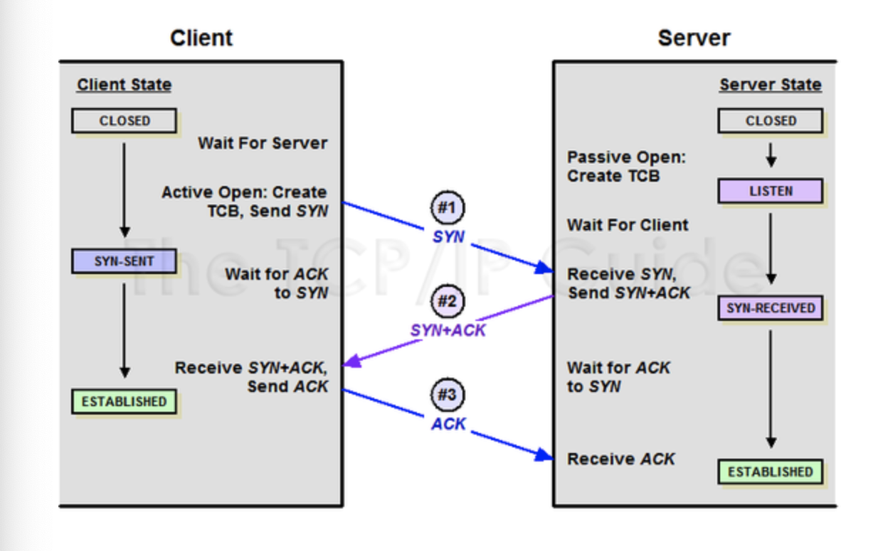
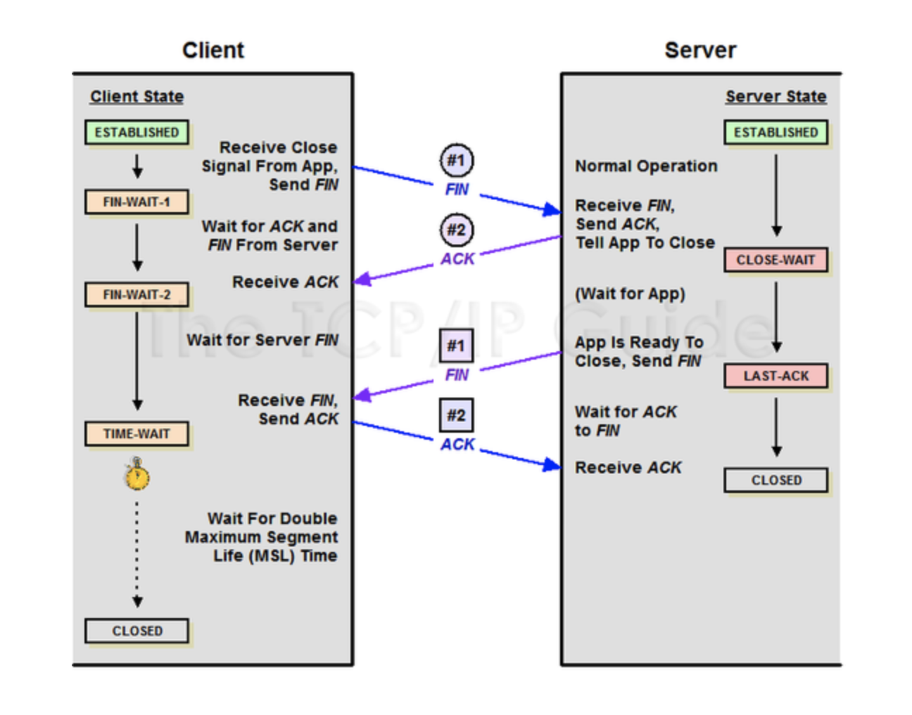

# <전산학 기출 정리>

## 1. 데이터베이스

## 2. 전자계산기 구조

## 3. 컴퓨터 구조

## 4. 운영체제

## 5. 소프트웨어 공학

### 1. 객체지향기법의 SOLID

- **단일 책임 원칙 (Single Responsiblity Principle)**
  - 모든 클래스는 각각 **하나의 책임**만 가져야 한다. 클래스는 그 책임을 완전히 **캡슐화**해야 함을 말한다.
- **개방-폐쇄 원칙 (Open Closed Principle)**
  - **확장에는 열려있고 수정에는 닫혀있는**. 기존의 코드를 변경하지 않으면서( Closed), 기능을 추가할 수 있도록(Open) 설계가 되어야 한다는 원칙을 말한다.
- **리스코프 치환 원칙 (Liskov Substitution Principle)**
  - **자식 클래스**는 언제나 자신의 **부모 클래스를 대체**할 수 있다는 원칙이다. 즉 부모 클래스가 들어갈 자리에 자식 클래스를 넣어도 계획대로 잘 작동해야 한다.
- **인터페이스 분리 원칙 (Interface Segregation Principle)**
  - 한 클래스는 자신이 **사용하지않는 인터페이스는 구현하지 말아야 한다**. 하나의 일반적인 인터페이스보다 여러개의 구체적인 인터페이스가 낫다.
-  **의존 역전 원칙 (Dependency Inversion Principle)**
  - 의존 관계를 맺을 때 변화하기 쉬운 것 또는 자주 변화하는 것보다는 **변화하기 어려운 것**, 거의 변화가 없는 것에 **의존**하라는 것이다. 한마디로 구체적인 클래스보다 인터페이스나 추상 클래스와 관계를 맺으라는 것이다.

## 6. 데이터통신

### 1. TCP vs UDP

- **TCP**

  - 연결형 서비스로 **가상 회선 방식**을 제공

  - `3-way handshaking`(SYN -> SYN+ACK -> ACK)과정을 통해 연결을 설정하고, `4-way handshaking`(FIN -> ACK -> FIN -> ACK)을 통해 해제

    - 3-way handshaking

    

    - 4-way handshaking

    

  - 흐름 제어 및 혼잡 제어

  - **높은 신뢰성**을 보장

  - UDP보다 속도가 **느림**

  - **전이중**(`Full-Duplex`), **점대점**(`Point to Point`) 방식

  - 서버소켓은 연결만 담당

  - 연결과정에서 반환된 클라이언트 소켓은 데이터의 송수신에 사용된다

  - 서버와 클라이언트는 1:1

  - **스트림 전송**으로 전송 데이터 크기가 무제한

  - 패킷에 대한 응답을 해야해서(시간 지연, CPU 소모) **성능이 낮음**

  - **스트리밍 서비스에 불리**

- **UDP**

  - **비연결형 서비스**로 데이터그램 방식 제공
  - 정보를 주고 받을 때 신호절차를 거치지 않음
  - UDP헤더의 checkSum 필드를 통해 **최소한의 오류만 검출**
  - **신뢰성이 낮음**
  - TCP보다 **속도가 빠름**
  - 연결 자체가 없어서 서버 소켓과 클라이언트 소켓의 구분이 없음
  - 소켓 대신 **IP를 기반**으로 데이터 전송
  - 서버와 클라이언트는 1:1, 1:N, N:M 등으로 연결 가능
  - 데이터그램(메세지)단위로 전송되며 그 크기는 65535바이트로, 크기가 초과되면 잘라서 보냄
  - 흐름제어가 없어서 제대로 전송 되었는지 오류가 없는지 확인 불가
  - 파일 전송과 같은 신뢰성이 필요한 서비스보다 성능이 중요시 되는 경우에 사용(**스트리밍**)
  - TCP와 다른 점 -> 헤더에 Length가 포함

## 7. 정보통신

## 8. 정보보안

### 1. 공개키 암호화 vs 대칭키 암호화

- **대칭키**
  - 하나의 비밀키를 **양쪽(client & server)이 모두 같이 사용**
  - 암호화와 복호화에 사용하는 **키가 같은** 암호화 알고리즘
  - 공개키와 비밀키를 별도로 가지는 것과 구별되는데, 이와 비교하면 **계산속도가 빠르다**
  - 비밀키 하나만 알아내면 암호화된 내용을 해독 가능 → 해커로부터 **안전 X**
  - 대킹키 암호는 암호화하는 단위에 따라[ 스트](http://gaeko-security-hack.tistory.com/101?category=735008)[림암호와 블록암호](http://gaeko-security-hack.tistory.com/101?category=735008)로 나눌 수 있음
  - **스트림암호**는 연속적인 비트/바이트를 계속해서 입력받아, 그에 대응하는 암호화 비트/마이트를 생성하는 방식
  - **블록암호**는 정해진 한 단위(블록)을 입력받아 그에 대응하는 암호화 블록을 생성하는 방식 
    - 블록암호의 경우 적절한 운용모드를 조합하면 블록 단위보다 큰 입력을 처리할 수 있음. 또한 스트림암호와 유사하게 지속적인 입력에 대해 동작할 수 있음. (대신 입출력 단위는 스트림암호보다 큰 블록 단위가 됨)
  - 대킹키 기법을 사용하는 암호 알고리즘 방식으로 `DES, 3-DES, AES, SEED, ARIA, MASK` 등이 있다. 
  - **공개키**
  - 비밀키 하나 만 가지는 대칭키 암호 방법과 달리, **공개키와 비밀키 두 개**가 존재
  - 공개키 암호를 구성하는 알고리즘을 대칭키 암호 방식과 비교하여 **비대칭 암호**라고 불림
  - **암호화와 복호화에 사용하는 키가 서로 다름**
  - 암호화할 때의 키는 공개키(public key), **복호화**할 때의 키는 **개인키**(private key)
  - 공개키는 누구나 알 수 있지만, 그에 대응하는 **비밀키는 키의 소유자만**이 알 수 있어서 
  - 특정한 비밀키를 가지는 사용자만이 내용을 열어볼 수 있도록 하는 방식.

### 2. 퍼블릭 블록체인 vs 프라이빗 블록체인 vs 컨소시엄 블록체인

|                      | 퍼블릭  | 프라이빗  | 컨소시엄  |
| -------------------- | ------- | --------- | --------- |
| **허가 필요 유무**   | No      | Yes       | Yes       |
| **읽기 권한**        | Anyone  | Invited   | Flexible  |
| **쓰기 권한**        | Anyone  | Confirmed | Confirmed |
| **소유자**           | Nothing | Who       | Whose     |
| **참여자 확인 여부** | No      | Yes       | Yes       |
| **트랜잭션 속도**    | Slow    | Fast      | Fast      |

## 9. 프로그래밍 언어

### 1. 컴파일러 vs 인터프리터

- **컴파일러**
  - 전체 번역
  - 실행속도가 인터프리터 속도보다 빠름
  - FORTRAN, COBOL, C 등이 해당
- **인터프리터**
  - 한줄 단위로 번역
  - 컴파일보다 느림
  - BASIC, LISP 등이 해당